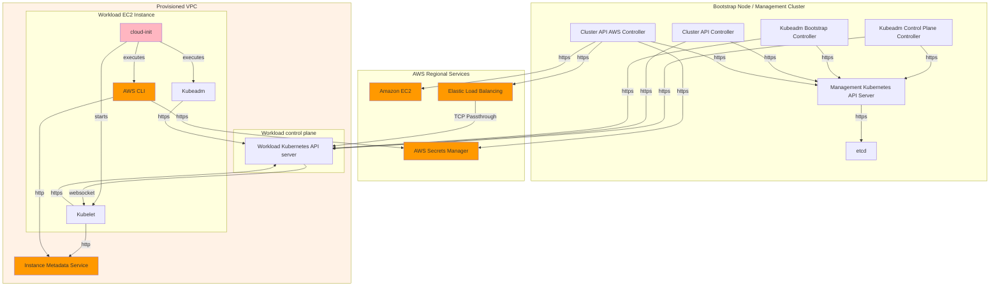

```mermaid
flowchart TB
    subgraph Bootstrap Node / Management Cluster
    kcp[Kubeadm Control Plane Controller]--https-->mgmtk8s
    kbc[Kubeadm Bootstrap Controller]--https-->mgmtk8s
    capi[Cluster API Controller]--https-->mgmtk8s
    capa[Cluster API AWS Controller]--https-->mgmtk8s
    mgmtk8s[Management Kubernetes API Server]--https-->mgmtetcd[etcd]
    end
    capa--https-->secrets
    capa--https-->EC2
    capa--https-->ELB
    kcp--https-->k8sapi
    capi--https-->k8sapi
    kbc--https-->k8sapi
    subgraph AWS Regional Services
    secrets[AWS Secrets Manager]
    EC2[Amazon EC2]
    ELB[Elastic Load Balancing]
    end
    subgraph VPC[Provisioned VPC]
    ELB--TCP Passthrough-->k8sapi
    IMDS[Instance Metadata Service]
    subgraph Workload EC2 Instance
    Kubelet
    Kubeadm
    cloud-init
    awscli[AWS CLI]
    cloud-init--executes-->awscli
    cloud-init--executes-->Kubeadm
    cloud-init--starts-->Kubelet
    end
    k8sapi--websocket-->Kubelet
    awscli--https-->secrets
    Kubeadm--https-->k8sapi
    Kubelet--http-->IMDS
    awscli--http-->IMDS
    Kubelet--https-->k8sapi
    subgraph Workload control plane
    k8sapi[Workload Kubernetes API server]
    end
    end

    classDef Amazon fill:#FF9900;
    classDef ThirdParty fill:#FFB6C1;
    classDef AmazonBoundary fill:#fff2e6;
    class EC2,secrets,EC2,ELB,IMDS,awscli Amazon
    class cloud-init ThirdParty
    class VPC AmazonBoundary
```