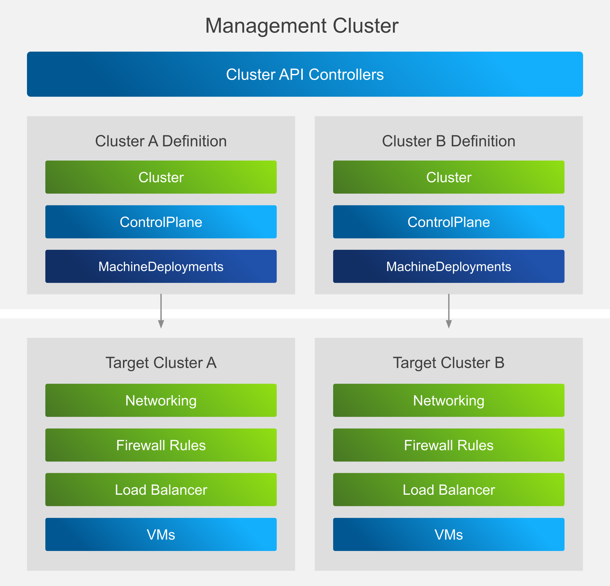
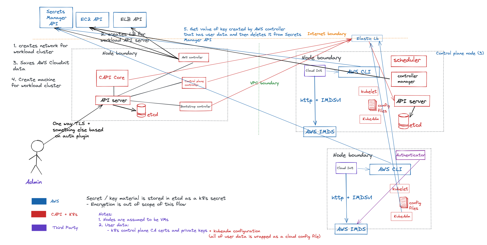

<!-- markdownlint-configure-file { "MD013": { "line_length": 120 } } -->
<!-- markdownlint-disable-file MD034 -->

# Cluster API Security Self-Assessment

## Metadata

* **Last Modified**: 2022-03-02
* **Youtube
  Recordings**: [Cluster API Security Self-assessment Playlist](https://www.youtube.com/watch?v=PhIhakKnJGE&list=PLrQN4xC6U5D8jQyZ9uw7nRX5Xo0bsgctI)
* **Authors** (alphabetical order):
  * [Ankita Swamy](https://github.com/Ankitasw)
  * [Naadir Jeewa](https://github.com/randomvariable)
  * [Pushkar Joglekar](https://github.com/pushkarj)
  * [Robert Ficcaglia](https://github.com/rficcaglia)
* **Reviewers** (alphabetical order):
  * [Fabrizio Pandini](https://github.com/fabriziopandini)
  * [Lubomir I. Ivanov](https://github.com/neolit123)
  * [Stefan Büringer](https://github.com/sbueringer)

## Overview

This is a working document to describe the security assessment of
the [Cluster API](#cluster-api) sub-project of
[Kubernetes](#Kubernetes-Security-Review). This is the pilot exercise to enable
[Kubernetes SIG Security](#Kubernetes-SIG-Security) to extend the great
processes and methodologies from CNCF Security TAG (Technical Advisory Group) on
doing [security reviews](#TAG-Security-Reviews)

### Impact

This is a pilot exercise on how Kubernetes SIG Security can perform a security
assessment of sub-projects where there may or may not be a separate working
group or a SIG focssed on the sub-project and security. For example in this
pilot, we have SIG Cluster Lifecycle focused on cluster-api project and
sig-security focused on overall security of the Kubernetes project including its
sub-projects.

### Scope

#### Process level

Complete an end to end assessment, solicit and incorporate feedback on the
process, tools and methodologies to define how this process can be revised after
completion of this initial pilot as a template for future iterations of CAPI
itself, and other future sub-project assessments. As a derivative product of
this effort it is hoped that the sub-project community learns new things about
secure coding, secure devops, security reviews / assessments, and reporting and
resolving security issues so as to become more self-sufficient and proactive in
the day-to-day maintenance and development of new features (i.e. instead of
relying on discrete and infrequent point-in-time efforts post hoc).

#### Technical

Cluster API sub-project in the context of AWS Provider is in scope for this
assessment. We will assess threats and review for security by going through two
flows: Creation of single control plane node in a workload cluster and creation
and joining of single worker node in the workload cluster

### Not in Scope

This is not a formal code audit, pentest, vulnerability scan, or other
point-in-time determination of the security of Cluster API. It is meant to be an
input into such activities in the future - either “organically” by community
members, or as part of a LF/CNCF paid external audit effort (refer to Kubernetes
External Audit RFP Roadmap effort), or other community or commercial efforts.

## Communication Channels

### Slack channels in Kubernetes Workspace

Visit https://slack.k8s.io to request an invite

* [#sig-security-assess-capi](#sig-security-assess-capi) - Working channel for
  this review
* [#cluster-api](#cluster-api) - Main Cluster API channel
* Provider channels:
  * [#cluster-api-aws](#cluster-api-aws) - Cluster API Provider AWS
  * [#cluster-api-azure](#cluster-api-azure) - Cluster API Provider Azure
  * [#cluster-api-openstack](#cluster-api-openstack) - Cluster API Provider
    OpenStack
  * [#cluster-api-baremetal](#cluster-api-baremetal) - General bare metal, incl.
    Metal3, Tinkerbell and BYOH
  * [#cluster-api-vsphere](#cluster-api-vsphere) - Cluster API Provider vSphere

### Mailing lists

* [kubernetes-sig-cluster-lifecycle@googlegroups.com](#kubernetes-sig-cluster-lifecycle@googlegroups.com)
* [kubernetes-sig-security@googlegroups.com](#kubernetes-sig-security@googlegroups.com)

### GitHub tracking

Tracking issues for this security audit have been opened as follows:

* Kubernetes SIG Security: https://github.com/kubernetes/community/issues/5814
* Cluster API: https://github.com/kubernetes-sigs/cluster-api/issues/4446
* CNCF Security TAG: https://github.com/cncf/tag-security/issues/603

### Primary Community Contact

Same as authors above

## Project Overview

Kubernetes Cluster API’s aim is to provide declarative APIs and tooling to
simplify the provisioning, upgrading and operating of multiple Kubernetes
clusters. Cluster API uses Kubernetes-style APIs and patterns to automate
cluster lifecycle management for platform operators. The supporting
infrastructure, like virtual machines, networks, load balancers, and VPCs, as
well as the Kubernetes cluster configuration are all defined in the same way
that application developers operate deploying and managing their workloads. This
enables consistent and repeatable cluster deployments across a wide variety of
infrastructure environments.

### Project Goals

* To manage the lifecycle (create, scale, upgrade, destroy) of
  Kubernetes-conformant clusters using a declarative API.
* To work in different environments, both on-premises and in the cloud.
* To define common operations, provide a default implementation, and provide the
  ability to swap out implementations for alternative ones.
* To reuse and integrate existing ecosystem components rather than duplicating
  their functionality (e.g. node-problem-detector, cluster autoscaler,
  SIG-Multi-cluster).
* To provide a transition path for Kubernetes lifecycle products to adopt
  Cluster API incrementally. Specifically, existing cluster lifecycle management
  tools should be able to adopt Cluster API in a staged manner, over the course
  of multiple releases, or even adopting a subset of Cluster API.

### Project Non-goals

* To add these APIs to Kubernetes core (kubernetes/kubernetes).
* This API should live in a namespace outside the core and follow the best
  practices defined by api-reviewers, but is not subject to core-api
  constraints.
* To manage the lifecycle of infrastructure unrelated to the running of
  Kubernetes-conformant clusters.
* To force all Kubernetes lifecycle products (kops, kubespray, GKE, AKS, EKS,
  IKS etc.) to support or use these APIs.
* To manage non-Cluster API provisioned Kubernetes-conformant clusters.
* To manage a single cluster spanning multiple infrastructure providers.
* To configure a machine at any time other than create or upgrade.
* To duplicate functionality that exists or is coming to other tooling, e.g.,
  updating kubelet configuration (c.f. dynamic kubelet configuration), or
  updating apiserver, controller-manager, scheduler configuration (c.f.
  component-config effort) after the cluster is deployed.

### Intended Uses of the Project

Cluster API may be used as a standalone tool, using the clusterctl CLI to
install and manage Cluster API components as well as template out clusters.
Cluster API may also be used in whole or in part by Kubernetes distributions.

### Personas

#### Cloud Admin

The cloud admin operates and manages the infrastructure on top of which
Kubernetes clusters are deployed. They may or may not have specific experience
with Kubernetes, but understand the underlying platform. They are responsible
for tenancy management, networking, security of the cloud environment, as well
as capacity planning, policy for usage of the cloud and backup and disaster
recovery.

#### Platform Operator

The platform operator is focused on building a developer platform on top of
Kubernetes. They standardise operations and create policies for the running of
clusters on different infrastructures. They onboard development teams onto
Kubernetes and build standardised pipelines for software delivery.

#### Workload Operator

The workload operator is a member of a software development team within a
specific line of business. They may have varying levels of experience with
Kubernetes and are interested in automation of software delivery for their LOB.
They are also interested in monitoring, backup and restore and the consumption
of cloud services.

#### Application Developer

The workload operator is a member of a software development team within a
specific line of business. They may have little experience with Kubernetes, and
mostly care about getting their application running. They will typically work
only with the Kubernetes clusters they have been given access to.

### Primary Components

### Types of Clusters

In Cluster API, we normally refer to two types of clusters: _management
clusters_ and _workload clusters_.

#### Workload Clusters

Clusters managed _by_ Cluster API are called _workload clusters_, and are
primarily what workload operators and application developers will interact with.

#### Management Clusters

A management cluster is a cluster that actually runs the Cluster API components,
contains the resources representing the cluster and is reaching out to cloud
provider services to perform infrastructure operations. We would expect the
Cloud Admin, Platform Operator and to some extent Workload Operators to interact
with the Management Cluster, but not typically Application Developers. The
diagram below illustrates the relationship between management and workload
clusters.

**Figure 1**: Relation between management cluster and workload cluster

##### Self-managed Management Cluster

A self-managed management cluster is a management cluster whose lifecycle is
being managed by Cluster API running on the management cluster itself.

#### Bootstrap Cluster

A bootstrap cluster is typically a Kubernetes “cluster” running on a local
workstation - in the Cluster API book, we typically recommend the usage of kind,
but any developer Kubernetes distribution is sufficient. This is used to spin up
an initial cluster with Cluster API which maybe converted _into_ a management
cluster. This is covered later. (TODO). It is expected that platform operators
use a bootstrap cluster to provision the initial management cluster.

##### Cluster API Core Controller

Cluster API Core controller provides high level management of basic primitives in Cluster API. It provides a
blueprint of the cluster and its components like machine deployment, machineset,
and machines which acts as reference for cloud infrastructure providers to
create infrastructure related components.

##### Cluster API Bootstrap Kubeadm Controller

Cluster API Bootstrap Kubeadm Controller is a provider which helps to convert a
machine into a kubernetes node and thus bootstrapping the whole cluster and its
machines. It uses kubeadm for bootstrapping kubernetes.

It takes care of initializing control plane nodes and bootstrapping other nodes
as well.

Once all the nodes are bootstrapped, the Bootstrap kubeadm Controller then
attaches the control plane and worker nodes to the cluster with their specific
roles within the cluster.

##### Cluster API Kubeadm Control Plane Controller

Cluster API Kubeadm Control plane controller provides ability to manage a
control plane, including bootstrapping, scaling and deletion of control plane
without disturbing the whole cluster quorum.

The general expectation from the control plane controller is to make sure that
the control plane node is created with the services like etcd, kubernetes API
server, kubernetes controller manager, scheduler, kube-proxy and CoreDNS.
It also provides the current status of the control plane to the operators.

Kubeadm control plane controller also manages kubeconfig secrets, which can be
utilized by the operators to access the workload clusters.

##### Cluster API Provider AWS Controller

Cluster API Provider AWS Controller is the infrastructure provider which manages
resources that provides the infrastructure required to run the cluster.

The general expectation from AWS controllers is to provision the network and
compute resources while adhering to the AWS best practices. Once the
infrastructure is provisioned, then the EC2 instances are provisioned and form
the AWS Kubernetes cluster.

##### Kubeadm

Kubeadm is used by the bootstrap controller for bootstrapping Kubernetes
clusters.

##### Cloud-Init

The Cluster API bootstrap kubeadm controller generates the cloud-init scripts
which contains userdata to convert a machine into a kubernetes node using
kubeadm. This userdata is fetched from AWS secrets manager in the form of bash
script. This cloud-init script is then stored as secrets in kubeadm config and
used by the Cluster API Provider AWS controller for bootstrapping and creating
EC2 instances.

The userdata also contains the CA certificate which is used by the control
plane.

### Boundaries and control plane interactions

Cluster API components interact across the following boundaries:

* Node boundary
* VPC boundary
* Internet boundary

There are three types of clusters in a typical cluster API environment. For more
details please refer to [Types of Clusters](#types-of-clusters).

We will limit scope of this assessment, to two point in time states with a
beginning and end state:

1. Existing Management cluster creates a control plane node of a workload
   cluster
2. Existing Management cluster and Workload cluster control plane add a new
   worker node

### Data Stores and Data Flows

#### Data Flow diagrams

The following data flow diagram is applicable to all of the different data flows
in this document, but the exact contents of each flow changes depending on the
scenario.

**Figure 2**: Mermaid Version: In Scope Data Flow for Cluster API and Cluster
API Provider AWS

**Figure 3**: ExCaliDraw format: In Scope Data Flow diagram for Cluster API and
Cluster API Provider AWS

#### Common Flows

##### EC2 Instance start

This is the common start sequence for a EC2 instance (VM) on AWS, and is
included in the other flows.

1. AWS controller receives notification of created secret containing generated
   cloud-init config, connects with AWS Secrets Manager API, chunks and stores
   the cloud-init data at `/aws.cluster.x-k8s.io/<Random UUID v4>`
2. AWS controller runs a new EC2 instance (VM) at the Amazon EC2 API for the new
   node. The inserted instance userdata contains a bash script containing the
   location of the cloud-init data in AWS Secrets Manager
   (`/aws.cluster.x-k8s.io/<Random UUID v4>`)
3. On start-up, cloud-init in the new worker node is started by systemd.
4. cloud-init reads the userdata from AWS IMDS (Instance MetaData Service) that
   exists between VM and hypervisor over link-local where it is hosted without
   any authentication or encryption. However, IMDS is not accessible outside of
   the physical machine’s local network.
5. cloud-init reads and executes the bash script, which in turn executes the AWS
   CLI to first download the 'real' cloud-init configuration. The CLI is assumed
   to be installed on the image. Credentials for working with Amazon APIs are
   also retrieved from the instance metadata, and is set and rotated by the AWS
   EC2 control plane automatically.
6. Once fetched this data is deleted by AWS CLI from Secrets Manager API.
7. If the deletion fails, then as long as the node has successfully registered
   with the API server, then CAPA will also attempt a deletion of the secret.
   This operation is idempotent

###### Important considerations for other cloud providers

Cluster API Provider AWS is unique in this instance in using AWS Secrets Manager
to store private key material independently of the hypervisor<-guest->
communication protocol (aka Instance Meta Data Service (IMDS)). This protects
against unauthorised retrieval of CA key material and bootstrap tokens by
placing them in a seperate datastore to the hypervisor, and using special
credentials only visible to the VM itself to authorise retrieval. In most cloud
providers, including AWS, Azure and vSphere, read-only access to the cloud
provider's VM service also allows users to read the data stored in the IMDS,
e.g. giving "read-only" access to the EC2 web console can allow someone to read
the IMDS. Where a mechanism like Secrets Manager isn't used, the plain-text data
can be read unencrypted. When Secrets Manager is used, the user will be able to
see the URL of the location containing the private key material, but unless they
have been expressly granted authorisation to the URL, they are not able to read
it. This feature is unique to the cloud-init implementation in Cluster API
Provider AWS. Support for reading from S3 has been added for Ignition, as well
as AWS SSM Parameter Store for special regions not having the Secrets Manager
API. At the present time, similar mechanisms are not present in Cluster API
Provider Azure or Cluster API Provider vSphere.

#### Flow 1: Instantiation of a workload cluster control plane

1. Cloud admin OR workload operator creates CRDs on the API server of the
   management cluster. Standard authentication methods for Kubernetes API access
   are used (auth tokens, mutual TLS, authentication plugins).
2. Cluster API Core controller is assumed to be running on the same node (
   co-located) as API server IFF this is a bootstrap scenario, but this is not a
   hard requirement for a long-lived management cluster..
3. Bootstrap controller, Control plane controller and AWS controller interact
   directly with API server. All personas indirectly interact with these
   controllers via CRUD operations on CRDs and core K8s resources on the API
   server.
4. The kubeadm control plane controller creates CA key material, stored in etcd
   as Kubernetes secrets.

* These include all standard CAs for Kubernetes:
  * etcd CA
  * kubernetes CA
  * kubernetes front proxy CA
* In addition, an administrative kubeconfig is also generated for the new
  cluster and stored as a secret.
* Kubernetes secrets are **not** encrypted by default. Encrypting these secrets
  is out of scope of this activity for
* Cluster API

5. The three controllers then create several different CRDs within the
   management/bootstrap cluster’s API server.
6. The Cluster API Provider AWS (CAPA) controller starts reaching out to EC2 API
   which crosses internet boundary, with authorisation headers
   using [AWS4-HMAC-SHA256] to create a network for the workload cluster.
7. CAPA then connects with ELB API to create a load balancer for API server of
   workload cluster, and waits for the API server to be DNS resolvable.
8. See "EC2 Instance Start" flow
9. cloud-init writes out a kubeadm configuration, as well as all of the key
   material to /etc/kubernetes/pki and executes kubeadm pointing at the
   configuration,
10. kubeadm starts the kubelet process via systemd.
11. KubeAdm the default bootstrap provider, then ingests the KubeAdm
    configuration and then restarts Kubelet until kubelet is successfully
    started with kubelet configuration. Note: kubeadm flow to get the kubelet up
    and running is out of scope of this assessment, but is broadly.

* Use the key material to generate all required certificates.
* Generate static pod manifests for the control plane components.
  * OCI images for kubernetes control plane components (scheduler,
    controller-manager, API server, etcd) are typically pre-baked in the machine
    for which kubeAdm creates static pods.
* Wait for kubelet to initialize etcd and the control plane.
* Generate a bootstrap service account token for the kubelet to self-register as
  a node.

12. Control plane, CAPI Core, AWS and Bootstrap controller then talk to API
    server via ELB created by ELB API to manage the workload cluster.

At the end of this flow, we have a workload cluster running with one control
plane node and zero worker nodes.

#### Flow 2: Adding a machine to the workload cluster control plane

1. KubeadmControlPlane Controller (KCP) reads the CA certificate key material
   for the cluster from the management cluster (as secrets).
2. KCP templates out a set of Machine, AWSMachine and KubeadmConfig resources
   for the new node, including references to the copies (secretRefs) of the CA
   certificate key material in the KubeadmConfig resource.
3. Bootstrap controller is notified of new KubeadmConfig resource, and renders a
   cloud-init configuration as a secret.
4. See "EC2 Instance Start flow"
5. KCP continuously connects to the workload cluster's control plane API server,
   scans for all control plane nodes, and opens a proxied connection via the API
   server, and the node's kubelet to etcd using a generated client certificate
   for etcd.
6. cloud-init writes out a kubeadm configuration and all CA certificate key
   material to relevant locations in /etc/kubernetes/pki
7. cloud-init executes kubeadm, and kubeadm starts kubelet via systemd.
8. kubeadm reads a kubeadm configmap from the kube-system namespace on the
   existing control plane member (via the ELB)
   to get the list of etcd peers.
9. kubeadm stamps out static pod manifests for the control plane instance
10. kubeadm monitors the etcd join process.
11. kcp monitors the etcd join process via its proxying.
12. kubeadm generates a bootstrap token for kubelet to register to the control
    plane.
13. kubeadm completes the join process as per Flow 3.

#### Flow 3: Adding a new worker node to a workload cluster

1. Cluster API controller templates out a set of Machine, AWSMachine and
   KubeadmConfig resources for the new node.
2. Bootstrap controller is notified of new KubeadmConfig resource, and creates a
   service account on the workload cluster.
3. This service account token with generated cloud init data is stored in
   management cluster's Kubernetes API server.
4. See "EC2 Instance Start" flow
5. cloud-init writes out a kubeadm configuration containing the service account
   token and executes kubeadm pointing at the configuration.
6. kubeadm starts the kubelet process via systemd.
7. Kubelet then creates a certificate signing request and sends it to the
   workload kubernetes API server, using the service account token as the
   authorisation header. The serving certificate of the control plane is checked
   beforehand against that provided in the configuration.
8. Kubeadm *on the worker node* checks for the existence of the CSR on the
   workload API server and  *authorises* the CSR request. The only check,
   performed on the client side is that the machine name is not already
   registered.
9. Workload control plane's running instance of the
   kubernetes-controller-manager signs the certificate.
10. Kubelet retrieves the signed certificate, and then registers itself as a
    node in the workload control plane.
11. Bootstrap controller keeps track of the existence of the worker node in the
    workload cluster. If the node does not appear within the expiry period (15
    mins) of the token, the bootstrap controller will keep renewing the token
    without any limits to how many times it can be renewed.
12. Cloud controller manager of the workload cluster will keep track of the
    existence of the new worker node and then validate the node name against the
    EC2 API to confirm that node is now part of a cluster and does not need to
    be deleted.

### 3rd Party Requirements (source, libraries, services, APIs)

SBOMs are not currently produced by the Cluster API project, but dependencies
are viewable in GitHub at:

* [https://github.com/kubernetes-sigs/cluster-api/network/dependencies](https://github.com/kubernetes-sigs/cluster-api/network/dependencies)
* [https://github.com/kubernetes-sigs/cluster-api-provider-aws/network/dependencies](https://github.com/kubernetes-sigs/cluster-api-provider-aws/network/dependencies)
* [https://github.com/kubernetes-sigs/cluster-api-provider-azure/network/dependencies](https://github.com/kubernetes-sigs/cluster-api-provider-azure/network/dependencies)
* [https://github.com/kubernetes-sigs/cluster-api-provider-vsphere/network/dependencies](https://github.com/kubernetes-sigs/cluster-api-provider-vsphere/network/dependencies)

For all the subprojects, the main dependency is
[Kubernetes Controller Runtime](https://github.com/kubernetes-sigs/controller-runtime)
, and for each of the providers, it would be there primary infrastructure API,
e.g. AWS SDK for Go, Microsoft Azure SDK for Go and
[govmomi](https://github.com/vmware/govmomi).

Cluster API requires a bootstrap cluster in order to produce a self-managed
management cluster, and we normally recommend
“[kind](https://kind.sigs.k8s.io/)” (Kubernetes in Docker), which depends on
Docker or Podman for operation.

### Secure development practices

_Refer to the CII Best Practices, specifically the security section(s) as a
start. As a bonus, consider NIST standards and industry guidance._

* _Development Pipeline Impact. It is assumed that a sub-project may already be
  subject to the parent project’s decisions so link to, or briefly describe the
  testing and review processes that the software undergoes as it is developed
  and built. Of interest might be specific information as to whether
  contributors are required to sign commits, if project artifacts/images are
  immutable and signed, any automated checks for vulnerabilities, etc._
* _Communication Channels. Reference where you document how to reach your main
  project team and sub-project leads, for example:_
  * _Internal. How do team members communicate with each other?_
  * _Inbound. How do users or prospective users communicate with the team?_
  * _Outbound. How do you communicate with your users? (e.g. flibble-announce@
    mailing list)_
* _Ecosystem. How does your software fit into the main project and other cloud
  native ecosystems?_

### Development Workflow

Cluster API’s development workflow is documented within the repository’s
[CONTRIBUTING.md](https://github.com/kubernetes-sigs/cluster-api/blob/main/CONTRIBUTING.md)

Key processes include:

* All source code is publicly available in Github
* All pull requests trigger jobs that perform:
  * Linting, including gosec static code analysis
  * Unit tests
  * E2E tests using nested Docker as a simulated infrastructure provider
  * Checks for breaking API changes
  * Tests for broken URLs in generated documentation
  * PRs cannot be merged without passing tests without an explicit /override
    from a maintainer
* Each PR requires approval from maintainers listed in the OWNERS file
* For all Cluster API subprojects, contributors are required to have signed the
  CNCF CLA, but no cryptographic signatures are required for individual commits.
* Pushes to the main branch are forbidden by convention
* Release process is almost fully automated via Github actions
* Checksum, signature and SPDX files are not currently generated for any
  artifacts
* Container images are produced automatically by Google CloudBuild, and Cluster
  API uses the upstream Kubernetes image promotion process to promote individual
  OCI SHAs from staging to release.
* Deployment manifests reference image tags rather than SHA digests
* ACLs for ownership of the repository and approvals are configured in code
  within the OWNERS file at the top of the repository as well as configured via
  the github.com/kubernetes/org repository.
* For Cluster API Provider AWS since v0.6.7 and Cluster API Provider Azure since
  v0.4.13 maintainers do GPG sign all tags, and maintainers are expected to
  maintain their GPG keys with public keys verifiable in Github. Cluster API
  Core repository has tags signed by Github Actions since v1.0.3

#### Identified gaps in development workflow

##### DEV-01: Outdated List of Maintainers

Listed maintainers of the Cluster API project are out of date and may continue
to have administrative access to the GitHub repository as well as perform image
promotion and have access to the staging Google Cloud account. A process to regularly
review ACLs(Access Control Lists) should be instituted.

Status: [planned](https://github.com/kubernetes-sigs/cluster-api/issues/6151) 

#### Core Infrastructure Initiative

Cluster API asserts being 96% in progress with regards to
the [Core Infrastructure Initiative (CII) badging process](https://bestpractices.coreinfrastructure.org/en/projects/5288)
.

##### DEV-02: Vulnerability report process is poorly defined

The project has a SECURITY_CONTACTS file which nominally follows the Kubernetes
vulnerability reporting process, but the file has not been maintained, and has
not been invoked for subprojects as far as the authors are aware. In addition,
the contacts only lists GitHub usernames - it isn’t clear how Kubernetes
security is to get in touch with project maintainers in the case of private
disclosure. To fix this, we would like to request a private google group, like
this `cluster-api-security@kubernetes.io` that can be used for private
discussions with SRC on any potential vulnerabilities discovered or reported for
cluster-api.

Status: [Planned](https://github.com/kubernetes-sigs/cluster-api/issues/5398)

##### DEV-03: Project should configure some fuzzing

Project lacked dynamic analysis / testing, to uncover reliability or security
issues under stress testing.

Status: [Implemented](https://github.com/kubernetes-sigs/cluster-api/issues/6059)

## Threat Modeling with STRIDE

### Spoofing

#### STRIDE-SPOOF-1 - Spoofing of Cloud Admin

The identity of the Cloud Admin with access to Management Cluster can be spoofed
by other users via stolen cloud and kubernetes credentials since cloud provider
credentials are stored or are able to retrived from the workload cluster.

For on-prem infrastructures, the Cloud Admin will have provisioned the cluster
with wide ranging permissions, including the ability to create and delete VMs,
add and remove disks etc... These by default will be written to the CPI
credentials file on the disk of the workload control plane instances. A user of
the cluster can start a pod with a host mount of /etc, and exfiltrate the cloud
provider credentials.

For hyperscaler environments like AWS, there is the ability to scope short lived
credentials to the level of EC2 instances. However, the permissions are still
broad for CPI and CSI to function, and a management cluster hosted in AWS will
have even more permissions, such as the ability to create and destroy EC2
instances. A user of the cluster can start a pod, and scrape the IMDS endpoint
living on link-local (`http://169.254.169.254`) and retrieve these credentials.
They are short-lived but a confused deputy attack is still possible.

Cloud Admin has access to multiple Cloud services like EC2, ELB, Secrets
Manager. Access to the management cluster basically provides this admin access
to all the managed workload clusters and its workloads as well.

#### STRIDE-SPOOF-1 Recommended mitigations

Securely manage Cloud and Kubernetes Credentials with following methods applied:

* Credentials are short-lived
  * Status: Implemented (AWS)
* Credentials are managed centrally from an authoritative identity store
  * Status: Implemented (AWS & Azure)
* Credentials can be revoked, if needed
  * Status: Implemented (AWS & Azure)
* Second pair of eyes are applied when executing privileged actions such as
  creating/deleting/updating a cluster
  * Status: [End user guidance to be written](#cluster-api-end-user-guide)
* Ensure credentials used by Cluster API are least privileges and setting access
  control on Cluster API controller namespaces to prevent unauthorised access by
  anyone other than cloud admin.
  - Status: Implemented for K8s RBAC, developer guidance to be written for
    providers
* Enable auditing on the management cluster as well as on the cloud provider
  * Status: [End user guidance to be written](#cluster-api-end-user-guide)

#### STRIDE-SPOOF-2 Spoofing of cloud provider services

Cloud provider services like Secrets Manager store sensitive data like cloudinit
configuration files
(shortlived). Other services like EC2 and ELB API have the ability to sniff
traffic destined to the API server of the workload cluster. Successful spoofing
of a cloud service could result in information disclosure and tampering of in
flight requests relevant to cluster and machine management.

#### STRIDE-SPOOF-2 Recommended Mitigations

* Verify server side identity to confirm that AWS service is indeed what it
  advertises to be.
  * Status: Implemented (vSphere) / Out-of-scope (AWS/Azure)
  * AWS maintainers note: We rely on
    the [AWS Shared Responsibility model](#AWS-Shared-Responsibility-model).
    There is realistically little we can do in the event of a major breach.
    Validation of server endpoints is left to the standard SDK.

#### STRIDE-SPOOF-3 Spoofing of image-builder maintainer

Description: Machine image for cluster is pre-baked and built by cluster API
maintainers. This image could be tampered with to include a cryptominer if the
accounts of maintainers that have privileges and ownership over the code and
machine image built for Nodes in a cluster.

#### STRIDE-SPOOF-3 Recommended Mitigations

* Implement 2FA for all maintainer accounts on Github. Apply the second pair of
  eyes principle when performing privileged actions such as image building or
  updates to the contents of the machine images.
  * Status: Implemented
  * AWS maintainers note: Public community consumed images are currently
    maintained by VMware staff. Access to this environment is 2FA protected and
    managed by an SRE team. In order to give more confidence to the community,
    it is planned to transfer image building to CNCF owned accounts.

#### STRIDE-SPOOF-4 Spoofing of a control plane node in a workload cluster

When a worker node is created, a user could somehow interfere with the boot,
e.g. breaking networking, assigning incorrect security groups. This would
prevent the encrypted cloud-init data from being deleted. If the user could gain
access to the node, they could use the IMDS provided credentials to read the
bootstrap token from Secrets Manager and attempt to register AS a control plane
node, since validation is only done client- side by kubeadm. This can allow the
attacker to gain access to secrets they should not be able to.

#### STRIDE-SPOOF-4 Recommended Mitigations

* Replace kubeadm node join mechanism with a host attestation mechanism.
  * Status: [Planned](https://github.com/kubernetes-sigs/cluster-api/issues/3762)

#### STRIDE-SPOOF-5 Spoofing of a worker node in a workload cluster

Any attacker controlled machine could claim to be a worker node that needs to
join a workload cluster and request user data from Secrets Manager API.

#### STRIDE-SPOOF-5 Recommended Mitigations

* Same as STRIDE-SPOOF-4.
  * Status: [Planned](https://github.com/kubernetes-sigs/cluster-api/issues/3762)

### Tampering

#### STRIDE-TAMPER-1 Tampering of Cluster API component binaries and configuration files

Cluster API components (Controllers and CAPI Core) can be tampered during build
time, during install

#### STRIDE-TAMPER-1 Recommended Mitigations

* At build time: Create SBoM of all the Cluster API components and verify
  checksum as a post build action
  *
  Status: [Issue filed](https://github.com/kubernetes-sigs/cluster-api/issues/6153)
* During install time: Perform mutual authentication when invoking clusterctl
  command. Verify checksum of the downloaded components. Download with TLS
  enabled to prevent in-transit tampering.
  * Status: implemented / planned / to be implemented / End User Guidance
* During runtime: Alert on modification or restarts of cluster API components to
  detect for potential tampering.
  * Status: [End user guidance to be written](#cluster-api-end-user-guide)

#### STRIDE-TAMPER-2 Tampering of Machine Images

Machine images used as Node OS images, can be tampered during build time, during
install time and during runtime

#### STRIDE-TAMPER-2 Recommended Mitigations

* At build time: Create SBoM of the Machine Image and verify checksum as a post
  build action
  *
  Status: [planned](https://github.com/kubernetes-sigs/image-builder/issues/803)
* During install time: Perform mutual authentication when Cloud Provider's controller 
  downloads Machine Image. Verify checksum of the downloaded machine image, before 
  marking them as available. Download with TLS enabled to prevent in-transit tampering.
  * Status: Partially implemented
    * Maintainers note: clusterctl by default uses Github APIs for releases
* During runtime: Disable or restrict SSH access to prevent updates to machine
  image at runtime. Create alerting for sensitive file systems and when the
  machine is restarted.
  * Status: [End user guidance to be written](#cluster-api-end-user-guide)
    * Maintainers note: No password or SSH auth key is stored in image builder
      by default, and a user may optionally set a password or add authorised
      keys during first-boot using cloud-init configurations.

### Repudiation

#### STRIDE-REPUDIATE-01 Repudiation of actions performed by Cloud Admin

Infra Admin has highly privileged access to cloud and cluster resources. Misuse
of permissions via actions performed by Infra Admin should be detectable and
logged for auditing purposes.

#### STRIDE-REPUDIATE-01 Recommended Mitigations

* Implement API server auditing for all clusters and Cloud API auditing to log
  all actions performed by Infra Admins. Additionally, implement centralized
  audit collection and alerting for any suspicious activity.
  * Status: [End user guidance to be written](#cluster-api-end-user-guide)

#### STRIDE-REPUDIATE-02 Repudiation of actions performed using cloud credentials

Cloud credentials that are used by the Cluster API components, have highly
privileged access to cloud resources. Misuse of these credentials by accidental
leakage or by cluster admins, should be detectable and logged for audit purposes

#### STRIDE-REPUDIATE-02 Recommended mitigations

* Recommended Mitigation: Implement Cloud API auditing to log all actions
  performed using cloud credentials granted to the management and workload
  cluster’s control plane. Additionally, implement centralized audit collection
  and alerting for any suspicious activity.
  * Status: [End user guidance to be written](#cluster-api-end-user-guide)

### Information Disclosure

#### STRIDE-INFODISCLOSE-1 Privilege escalation from workload cluster co-located with management cluster

Cluster API Provider AWS by default uses the same set of permissions for
workload and management control planes, and if a workload cluster is colocated
in the same AWS account as a management cluster, a user can use the credentials
in the workload cluster to snapshot the disk of the management cluster, create a
new EC2 volume, mount it to a node in the workload cluster, and exfiltrate the
etcd datastore.

#### STRIDE-INFODISCLOSE-1 Recommended mitigations

* CAPA should by default use separate IAM roles for workload clusters to
  management clusters to reduce the amount of privileges workload clusters have.
  * Status: Not yet considered
* Cluster API should consider supporting running CPI, CSI and other privileged
  control plane workloads on the management cluster to further minimise the
  privileges required by workload clusters.
  * Status: [planned](https://github.com/kubernetes-sigs/cluster-api/issues/5491)
* Strongly advise users to seperate workload clusters into different AWS
  accounts or Azure subscriptions.
  * Status: [End user guidance to be written](#cluster-api-end-user-guide)

#### STRIDE-INFODISCLOSE-2 Exposure of kubeadm token credentials

Exposure of kubeadm token located on the node or in Cloud resources like Secrets
Manager can lead to full or partial control over one or more clusters, and can
be reused to register as the control plane node itself, after which attacker can
get access to control plane secrets.

#### STRIDE-INFODISCLOSE-2 Recommended Mitigations

* kubeadm token is short lived or deleted
  * Status: [To be implemented](https://github.com/kubernetes-sigs/cluster-api/pull/4219)
* Disable or restrict SSH access to nodes in a cluster
  * Status: [End user guidance to be written](#cluster-api-end-user-guide)
* Audit KubeConfig files access, edits that are located on the node
  * Status: [End user guidance to be written](#cluster-api-end-user-guide)
* Implement cluster level Pod Security to prevent host mount access to pod
  * Status: [implemented](https://github.com/kubernetes-sigs/cluster-api/pull/6390)

#### STRIDE-INFODISCLOSE-3 - Exposure of Management and Workload Cluster CA private keys and certs

Exposure of Management Cluster CA private keys and certs on the node or in the
cloud resources like Secrets Manager can lead to full or partial control over
one or more clusters.

#### STRIDE-INFODISCLOSE-3 Recommended Mitigations

* Keep CA key/cert pairs short lived or deleted after use from Secrets Manager
  * Status: [planned](https://github.com/kubernetes-sigs/cluster-api/issues/5490)
  * Maintainer note: Linked issue is a pre-requisite for shortening CA lifetimes
* Shorten CA cert lifetime
  * Status: [planned](https://github.com/kubernetes-sigs/cluster-api/issues/5490)
  * Maintainer note: Linked issue is a pre-requisite for shortening CA lifetimes
* Disable or restrict SSH access to nodes in a cluster
  * Status: [End user guidance to be written](#cluster-api-end-user-guide)
* Audit access or edits to CA private keys and cert files located on the node
  * Status: [End user guidance to be written](#cluster-api-end-user-guide)
* Implement cluster level Pod Security to prevent host mount access to pod
  * Status: [implemented](https://github.com/kubernetes-sigs/cluster-api/pull/6390)

#### STRIDE-INFODISCLOSE-4 - Exposure of Cloud credentials that allow privileged actions

Cloud credentials consumed by cluster API components can be leaked or
exfiltrated to spoof Cluster API components or launch a denial of service attack

#### STRIDE-INFODISCLOSE-4 Recommended Mitigations

* Use short-lived credentials that are auto-renewed using node level attestation
  * Status: [Cloud Provider guidance to be written](#cluster-api-cloud-provider-guide)
* Disable or restrict SSH access to nodes in a cluster
  * Status: [End user guidance to be written](#cluster-api-end-user-guide)
* Implement cluster level Pod Security to prevent host mount access to pod
  * Status: [implemented](https://github.com/kubernetes-sigs/cluster-api/pull/6390)

### Denial of Service

#### STRIDE-DOS-1 - Misuse of cloud credentials to create unlimited number of cloud resources

Cloud credentials can be misused by someone who has access to it by accidentally
or maliciously creating very large number of cloud resources to exhaust cloud
capacity or for financial damage caused due to surprise bills

#### STRIDE-DOS-1 Recommended Mitigations

* Create safe defaults (soft and hard) for the maximum number of cloud resources
  that can be created.
* Apply rate limits on how many “create cloud resources” requests can be
  successfully processed using the same cloud credentials.
* Implement threshold based alerts when a particular soft limit is exceeded
  * Status: [planned](https://github.com/kubernetes-sigs/cluster-api/issues/6515)

#### STRIDE-DOS-2 - Misuse of Infra Admin credentials to create unlimited number of clusters

Infra Admin credentials can be misused by someone who has access to it by
accidentally or maliciously creating very large number of clusters to exhaust
capacity or slow down the operations team or for financial damage caused due to
surprise bills

#### STRIDE-DOS-2 Recommended Mitigations

* Create safe defaults (soft and hard) for the maximum number of clusters that
  can be created using a management cluster
* Apply rate limits on clusterctl and underlying APIs on concurrent and
  successive requests to create new clusters can be processed using the same
  Infra admin
* Implement threshold based alerts when a particular soft limit is exceeded for
  number of clusters
  * Status: [planned](https://github.com/kubernetes-sigs/cluster-api/issues/6516)
* Apply second pair of eyes principle when performing privilege actions such as
  creating a cluster by an Infra admin
  * Status: [End user guidance to be written](#cluster-api-end-user-guide)

#### STRIDE-DOS-3 - Misuse of Infra Admin credentials to create unlimited number of Nodes

Infra Admin credentials can be misused by someone who has access to it by
accidentally or maliciously creating very large number of nodes to exhaust
capacity or slow down the operations team or for financial damage caused due to
surprise bills

#### STRIDE-DOS-3 Recommended Mitigations

* Create safe defaults (soft and hard) for the maximum number of nodes that
  can be created using a management cluster

* Apply rate limits on clusterctl and underlying APIs on concurrent and
  successive requests to create new nodes can be processed using the same
  Infra admin
* Implement threshold based alerts when a particular soft limit is exceeded for
  number of nodes
  * Status: [planned](https://github.com/kubernetes-sigs/cluster-api/issues/6517) 
* Apply second pair of eyes principle when performing privilege actions such as
  creating a node by an Infra admin
  * Status: [End user guidance to be written](#cluster-api-end-user-guide)

#### STRIDE-DOS-4 - Misuse of Infra Admin credentials to create unlimited number of CRDs to exhaust etcd storage

Infra Admin credentials can be misused by someone who has access to it by
accidentally or maliciously creating a very large number of CRD objects in the
management cluster to exhaust underlying storage of etcd. This could occur as a
side effect of the previous threat of creating an unlimited number of clusters
but can also happen through an unlimited number of nodes and other cluster
resources being added to one or more clusters.

#### STRIDE-DOS-4 Recommended Mitigations

* Implement safe defaults (soft and hard) on how many CRD objects a Cluster API
  component can create, especially in a management cluster
  * Status: [planned](https://github.com/kubernetes-sigs/cluster-api/issues/6518)
* Safe defaults on number of cluster and nodes will also have side effect of
  preventing this threat
  * Status: planned

#### STRIDE-DOS-5 - Deleting ELB instance for API server of workload cluster to disconnect management cluster from workload cluster(s)

Elastic Lb instance is the single point of failure in terms of connectivity
between management cluster and workload clusters. If that load balancer instance
is deleted, all connectivity between management cluster and workload cluster
control planes is lost

#### STRIDE-DOS-5 Recommended Mitigations

* Implement heartbeats between management and workload cluster to quickly detect
  connectivity issues
  * Status: implemented / planned / to be implemented / End User Guidance
* Alert on deletion of Elastic Lb so that it can be quickly restored
  * Status: [End user guidance to be written](#cluster-api-end-user-guide)

#### STRIDE-DOS-6 Exhausting Cloud resources

Misuse of cloud resources to accidentally or purposefully create, delete, update
machine images or ELB instances could lead to resource exhaustion or surprise
bills or traffic congestion on cloud API pathways

#### STRIDE-DOS-6 Recommended Mitigations

* Implement rate limits for creation, deletion and update of cloud resources
  * Status: [Cloud Provider guidance to be written](#cluster-api-cloud-provider-guide)
* Apply second pair of eyes whenever possible for such activity
  * Status: [End user guidance to be written](#cluster-api-end-user-guide)
* Apply alerting on all cloud resource creation, update, deletion activities
  * Status: [End user guidance to be written](#cluster-api-end-user-guide)

### Elevation of Privilege

#### STRIDE-EOP-1  Using workload cluster credentials to get access to mgmt. Cluster

Workload cluster credentials could be used to elevate privileges such that the
attacker can get full or partial control over management cluster

#### STRIDE-EOP-1 Recommended Mitigations

* Separate workload cluster and management cluster at network level through VPC
  boundary
  * Status: [End user guidance to be written](#cluster-api-end-user-guide)
* Implement Cluster level Pod Security to prevent host access for someone with
  Create Pod access
  * Status: [implemented](https://github.com/kubernetes-sigs/cluster-api/pull/6390)
* Disable or limit node level SSH access
  * Status: [End user guidance to be written](#cluster-api-end-user-guide)
* Do not build a chain of trust for cluster CAs such that gaining access to
  workload cluster CA and private keys does _not_ provide access to management
  cluster
  * Status: [End user guidance to be written](#cluster-api-end-user-guide)
* Limit who can create pod on control plane nodes
  * Status: [End user guidance to be written](#cluster-api-end-user-guide)

#### STRIDE-EOP-2 Using create pod permission to get cluster admin access to workload cluster

Someone with create pod permissions can elevate their access by locating the
credentials that can give cluster-admin access to the attacker

#### STRIDE-EOP-2 Recommended Mitigation

* Limit who can create pod on control plane nodes
  * Status: [End user guidance to be written](#cluster-api-end-user-guide)
* Implement Cluster level Pod Security to prevent host access for someone with
  Create Pod access
  * Status: [implemented](https://github.com/kubernetes-sigs/cluster-api/pull/6390)
* Disable or limit node level SSH access
  * Status: [End user guidance to be written](#cluster-api-end-user-guide)

#### STRIDE-EOP-3 Use shared cloud credentials to get access to other unrelated cloud resources

Cloud credentials consumed by cluster API components could be used to create
cloud resources that are unrelated to the lifecycle of the cluster and misused
by attacker for their own gain

#### STRIDE-EOP-3 Recommended Mitigations

* Create dedicated cloud credentials that have only the necessary permissions to
  manage lifecycle of a cluster
  * Status: [End user guidance to be written](#cluster-api-end-user-guide)
* Any cloud resource not linked to a cluster after a fixed configurable period
  of time created by these cloud credentials, should be auto-deleted or marked
  for garbage collection
  * Status: [Cloud Provider guidance to be written](#cluster-api-cloud-provider-guide)

### Security issue resolution

## References

### Docs

* [Introduction to Cluster API](https://cluster-api.sigs.k8s.io/introduction.html)
* [Introduction to Image Builder](https://image-builder.sigs.k8s.io/introduction.html)
* [Introduction to Kubebuilder](https://book.kubebuilder.io/)

### Talks

* [Cluster API Deep Dive - Naadir Jeewa, VMware & Cecile Robert-Michon, Microsoft](https://www.youtube.com/watch?v=9SfuQQeeK6Q)

### Links

##### [AWS4-HMAC-SHA256](https://docs.aws.amazon.com/general/latest/gr/signature-version-4.html)

##### [AWS Shared Responsibility model](https://aws.amazon.com/compliance/shared-responsibility-model/)

##### [Cluster API](https://github.com/kubernetes-sigs/cluster-api/)

##### [Kubernetes Cluster API](https://github.com/kubernetes-sigs/cluster-api/)

##### [Kubernetes Security Review](https://github.com/cncf/tag-security/issues/github.com/kubernetes/kubernetes)

##### [TAG Security Reviews](https://github.com/cncf/tag-security/tree/main/assessments/guide)

##### [Kubernetes SIG Security](https://github.com/kubernetes/community/tree/master/sig-security)

##### [#sig-security-assess-capi](https://kubernetes.slack.com/archives/C022K4F2W4W)

##### [#cluster-api](https://kubernetes.slack.com/archives/C8TSNPY4T)

##### [#cluster-api-aws](https://kubernetes.slack.com/archives/CD6U2V71N)

##### [#cluster-api-vsphere](https://kubernetes.slack.com/archives/CKFGK3SSD)

##### [#cluster-api-openstack](https://kubernetes.slack.com/archives/CFKJB65G9)

##### [#cluster-api-baremetal](https://kubernetes.slack.com/archives/CHD49TLE7)

##### [kubernetes-sig-cluster-lifecycle@googlegroups.com](mailto:kubernetes-sig-cluster-lifecycle@googlegroups.com)

##### [kubernetes-sig-security@googlegroups.com](mailto:kubernetes-sig-security@googlegroups.com)

##### [cluster-api-end-user-guide](https://github.com/kubernetes-sigs/cluster-api/issues/6152)

##### [cluster-api-cloud-provider-guide](https://github.com/kubernetes-sigs/cluster-api/issues/6519)
