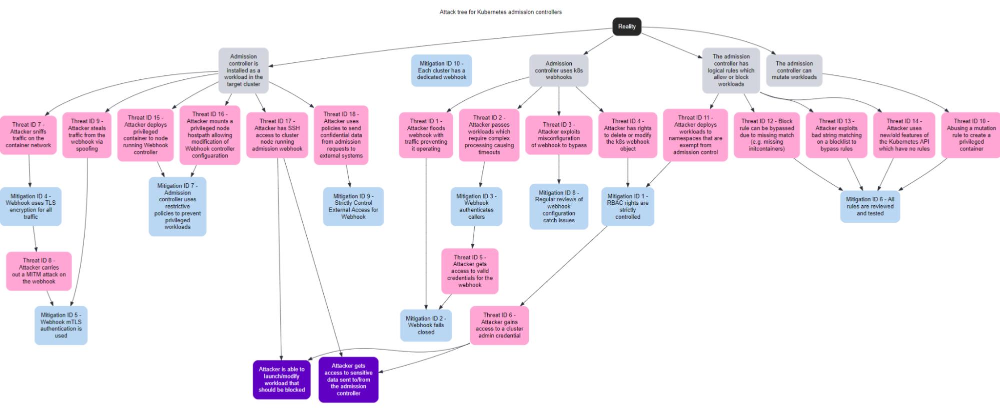

# Kubernetes Admission Control Threat Model

## Introduction

Kubernetes admission control is a key area of security for cluster operators. Admission control can be used to help ensure the consistent security of workloads and other resources deployed to clusters. 

As this is a key security control, there are design and implementation issues which should be considered to reduce the risk of an attacker being able to bypass this control, reduce its efficacy, or misuse it to attack the cluster.

The goal of this threat model is to set out, at a general level, threats which are faced by admission controller designers and operators.


## Target Audience

There are a number of groups who may find it useful to understand some of the risks and possible mitigations inherent in the use of admission controllers as a Kubernetes security control :-

* Authors of admission controllers. A general threat model could be useful to people who are developing admission controllers, looking at things to think about
* Organizations deploying admission controllers. Where organizations are using admission controllers for security in their clusters, it could be useful for them to know of common attacks and possible weaknesses, so they can review their own configuration.
* Security assessors who are responsible for assessing the security of existing and newly deployed Kubernetes clusters that use admission controllers.
* Kubernetes developers who need to understand updates to, and attacks against admission controllers to proactively avoid things in the future.


## Scope

This document considers the threats inherent in the use of Kubernetes admission controllers, and the design and implementation of rules used by those admission controllers as part of cluster security.


## Base Architecture

For the purposes of this threat model, the following base assumptions have been made about the architecture considered:-


* The admission controller is installed as a workload in the cluster that it protects. This is a common installation pattern for Kubernetes admission controllers.
* The admission controller uses webhooks for connection to the Kubernetes API server. The use of webhooks is the standard integration method for 3rd party admission controllers.
* The admission controller has a series of logical rules which allow or block workloads in the cluster to implement security controls.
* The admission controller can mutate workloads to modify their configuration to implement security controls.

Even where all of these assumptions aren’t true for a given environment (e.g. the admission controller is not installed within the cluster it protects) several of the recommended mitigations and threats will still be applicable.

## Attack Tree



## Threat Model

### Threats

#### Threat ID 1 - Attacker floods webhook with traffic preventing its operations

**Scenario**

An attacker who has access to the Webhook endpoint, at the network level, could send large quantities of traffic, causing an effective denial of service to the admission controller.

**Impact**

If the API server is unable to get a response from the admission controller within the configured timeout, a malicious workload, which would otherwise be blocked, could be admitted to the cluster.

**Mitigation**

- [Mitigation ID 2 - Webhook fails closed](#mitigation-id-2---webhook-fails-closed)

#### Threat ID 2 - Attacker passes workloads which require complex processing causing timeouts

**Scenario**

An attacker, who can access the admission controller at a network level, passes requests to the admission controller which require complex processing, causing timeouts as the admission controller uses compute power to process the workloads

**Impact**

If the API server is unable to get a response from the admission controller within the configured timeout, a malicious workload, which would otherwise be blocked, could be admitted to the cluster.

**Mitigation**

- [Mitigation ID 2 - Webhook fails closed](#mitigation-id-2---webhook-fails-closed)
- [Mitigation ID 3 - Webhook authenticates callers](#mitigation-id-3---webhook-authenticates-callers)


#### Threat ID 3 - Attacker exploits misconfiguration of webhook to bypass

**Scenario**

An attacker, who has rights to create workloads in the cluster, is able to exploit a mis-configuration to bypass the intended security control

**Impact**

An attacker would be able to deploy workloads which should have been blocked or mutated by the admission controller.

**Mitigation**

- [Mitigation ID 8 - Regular reviews of webhook configuration catch issues](#mitigation-id-8---regular-reviews-of-webhook-configuration-catch-issues)

#### Threat ID 4 - Attacker has rights to delete or modify the k8s webhook object

**Scenario**

An attacker who has Kubernetes API access, has sufficient privileges to delete the webhook object in the cluster.

**Impact**

Without a webhook configuration in the Kubernetes API, the admission controller will not be called, effectively allowing for it to be bypassed.

**Mitigation**

- [Mitigation ID 1 - RBAC rights are strictly controlled](#mitigation-id-1---rbac-rights-are-strictly-controlled)

#### Threat ID 5 - Attacker gets access to valid credentials for the webhook

**Scenario**

An attacker gains access to valid client credentials for the admission controller webhook

**Impact**

The attacker can send potentially malicious requests to cause a denial of service condition ([Threat ID 2](#threat-id-2---attacker-passes-workloads-which-require-complex-processing-causing-timeouts))

**Mitigation**

- [Mitigation ID 2 - Webhook fails closed](#mitigation-id-2---webhook-fails-closed)

#### Threat ID 6 - Attacker gains access to a cluster admin credential

**Scenario**

An attacker gains access to a cluster-admin level credential in the Kubernetes cluster.

**Impact**

A user with cluster-admin will be able to bypass an admission controller via a number of mechanisms.

**Mitigation**

**N/A**


#### Threat ID 7 - Attacker sniffs traffic on the container network

**Scenario**

An attacker who has access to the container network is able to sniff traffic between the API server and the admission controller webhook.

**Impact**

Any confidential information transmitted between the two services would be accessible to the attacker

**Mitigation**

- [Mitigation ID 4 - Webhook uses TLS encryption for all traffic](#mitigation-id-4---webhook-uses-tls-encryption-for-all-traffic)

#### Threat ID 8 - Attacker carries out a MITM attack on the webhook

**Scenario**

An attacker on the container network, who has access to the NET_RAW capability can attempt to use MITM tooling to intercept traffic between the API server and admission controller webhook.

**Impact**

The attacker would be able to modify requests and responses, potentially allowing for bypass of the admission controller.

**Mitigation**

- [Mitigation ID 5 - Webhook mutual TLS authentication is used](#mitigation-id-5---webhook-mutual-tls-authentication-is-used)

#### Threat ID 9 - Attacker steals traffic from the webhook via spoofing

**Scenario**

An attacker is able to redirect traffic from the API server which is intended for the admission controller webhook by spoofing.

**Impact**

The attacker would be able to return incorrect responses, potentially allowing workload to be admitted which should have been blocked.

**Mitigation**

- [Mitigation ID 5 - Webhook mutual TLS authentication is used](#mitigation-id-5---webhook-mutual-tls-authentication-is-used)

#### Threat ID 10 - Abusing a mutation rule to create a privileged container

**Scenario**

An attacker is able to cause a mutating admission controller to modify a workload, such that it allows for privileged container creation

**Impact**

The attacker would be able to gain access to one or more sets of host node resources.

**Mitigation**

- [Mitigation ID 6 - All rules are reviewed and tested](#Mitigation-id-6---all-rules-are-reviewed-and-tested)

#### Threat ID 11 - Attacker deploys workloads to namespaces that are exempt from admission control

**Scenario**

An attacker is able to deploy workloads to Kubernetes namespaces that are exempt from the admission controller configuration.

**Impact**

The admission controller rules are bypassed, allowing attackers to gain access to the cluster nodes.

**Mitigation**

- [Mitigation ID 1 - RBAC rights are strictly controlled](#mitigation-id-1---rbac-rights-are-strictly-controlled)

#### Threat ID 12 - Block rule can be bypassed due to missing match (e.g. missing initcontainers)

**Scenario**

An attacker created a workload manifest which uses a feature of the Kubernetes API which is not covered by the admission controller

**Impact**

The attacker is able to bypass the admission controller rules gaining access to the underlying cluster nodes.

**Mitigation**

- [Mitigation ID 6 - All rules are reviewed and tested](#Mitigation-id-6---all-rules-are-reviewed-and-tested)

#### Threat ID 13 - Attacker exploits bad string matching on a blocklist to bypass rules

**Scenario**

An attacker, who has rights to create workloads, bypasses a rule by exploiting bad string matching.

**Impact**

The attacker may be able to deploy workloads to the cluster that should have been blocked.

**Mitigation**

- [Mitigation ID 6 - All rules are reviewed and tested](#Mitigation-id-6---all-rules-are-reviewed-and-tested)

#### Threat ID 14 - Attacker uses new/old features of the Kubernetes API which have no rules

**Scenario**

An attacker, with rights to create workloads, uses new features of the Kubernetes API (for example a changed API version) to bypass a rule.

**Impact**

The attacker may be able to deploy workloads to the cluster that should have been blocked.

**Mitigation**

- [Mitigation ID 6 - All rules are reviewed and tested](#Mitigation-id-6---all-rules-are-reviewed-and-tested)

#### Threat ID 15 - Attacker deploys privileged container to node running Webhook controller

**Scenario**

An attacker, who has rights to deploy privileged containers to the cluster, creates a privileged container on the cluster node where the admission controller webhook operates.

**Impact**

With privileged access to the cluster node, the attacker can disrupt the operation of the admission controller.

**Mitigation**

- [Mitigation ID 7 - Admission controller uses restrictive policies to prevent privileged workloads](#mitigation-id-7---admission-controller-uses-restrictive-policies-to-prevent-privileged-workloads)


#### Threat ID 16 - Attacker mounts a privileged node hostpath allowing modification of Webhook controller configuration

**Scenario**

An attacker, who has rights to deploy hostPath volumes with workloads, creates a volume which allows for access to the admission controller pod’s files.

**Impact**

The attacker is able to modify the configuration of the admission controller pod, disrupting its operation.

**Mitigation**

- [Mitigation ID 7 - Admission controller uses restrictive policies to prevent privileged workloads](#mitigation-id-7---admission-controller-uses-restrictive-policies-to-prevent-privileged-workloads)

#### Threat ID 17 - Attacker has privileged SSH access to cluster node running admission webhook

**Scenario**

An attacker is able to log into cluster nodes as a privileged user via SSH.

**Impact**

The attacker is able to modify or disable the operation of the admission controller running on that cluster.

**Mitigation**

**N/A**


### Threat ID 18 - Attacker uses policies to send confidential data from admission requests to external systems

**Scenario**

An attacker is able to configure a policy that listens to admission requests and sends sensitive data to an external system. 

**Impact**

Sensitive information processed in the cluster could be passed to external systems.

**Mitigation**

- [Mitigation ID 9 - Strictly control external system access](#mitigation-ID-9---strictly-control-external-system-access)

### Mitigations


#### Mitigation ID 1 - RBAC rights are strictly controlled

**Description**

Kubernetes RBAC is a key element of securing in-cluster deployments. Users or service accounts with excessive privileges can affect the operation of admission controllers, allowing for them to be bypassed. The following operations should be restricted in clusters using admission controllers to users who should be able to affect them.


* MutatingWebhookConfigurations (create/edit/delete) - To prevent unauthorised modification of webhook objects
* ValidatingWebhookConfigurations (create/edit/delete) - To prevent unauthorised modification of webhook objects
* Services (create/edit) - To prevent the creation of services with configurations that could interfere with the operation of the webhook services (e.g. [CVE-2020-8554](https://github.com/kubernetes/kubernetes/issues/97076)). Where this can’t be restricted the admission controller should restrict creation of external IP services
* ClusterRoleBindings (create/edit) - To prevent modification of RBAC bindings that could in turn allow for webhooks to be affected
* ClusterRoles (create/edit) - To prevent modification of clusterroles that could in turn allow for webhooks to be affected
* Workload type (e.g. Pod/Deployment/CronJob) (create/edit) - This needs to be restricted in any namespace that is exempt from the admission controllers rules (e.g. kube-system) and also in any namespace that is used for admission controller workloads, in order to prevent creation of privileged workloads that could affect its operation or modification of admission controller workloads.

**Mitigated Threats**

 - [Threat ID 4 - Attacker has rights to delete or modify the k8s webhook object](#threat-id-4---attacker-has-rights-to-delete-or-modify-the-k8s-webhook-object)
 - [Threat ID 11 - Attacker deploys workloads to namespaces that are exempt from admission control](#threat-id-11---attacker-deploys-workloads-to-namespaces-that-are-exempt-from-admission-control)

#### Mitigation ID 2 - Webhook fails closed

**Description**

Webhooks in Kubernetes can be configured to either fail open, so that workloads are admitted if the webhook is unavailable, or to fail closed.

Care should be taken before setting a webhook to fail closed, as it could prevent new workloads being deployed to the cluster if it is unavailable.

**Mitigated Threats**

 - [Threat ID 1 - Attacker floods webhook with traffic preventing its operations](#threat-id-1---attacker-floods-webhook-with-traffic-preventing-its-operations)
  - [Threat ID 5 - Attacker gets access to valid credentials for the webhook](#threat-id-5---attacker-gets-access-to-valid-credentials-for-the-webhook)

#### Mitigation ID 3 - Webhook authenticates callers

**Description**

Webhook services can be made available to any caller that can reach them at a network level, but this can leave them at risk of attack.

Requiring all connections to the webhook service to be authenticated reduces the risks of denial of service style attacks and also reduces the attack surface available to unauthenticated attackers.

To achieve this the API server and Webhook service must have a mutually trusted Certificate authority which can issue certificates which can be appropriately validated.

**Mitigated Threats**

 - [Threat ID 2 - Attacker passes workloads which require complex processing causing timeouts](#threat-id-2---attacker-passes-workloads-which-require-complex-processing-causing-timeouts)

#### Mitigation ID 4 - Webhook uses TLS encryption for all traffic

**Description**

Traffic between the API server and webhook service should be encrypted using TLS version 1.2 or higher. This should be configured in the Kubernetes webhook configuration object and on the webhook service.

Enabling TLS encryption in this way will prevent traffic sniffing attacks.

**Mitigated Threats**

 - [Threat ID 7 - Attacker sniffs traffic on the container network](#threat-id-7---attacker-sniffs-traffic-on-the-container-network)

#### Mitigation ID 5 - Webhook mutual TLS authentication is used

**Description**

The connection between the Kubernetes API server and the webhook service should require mutual authentication, to ensure that only authenticated endpoints can communicate with each other.

**Mitigated Threats**

 - [Threat ID 8 - Attacker carries out a MITM attack on the webhook](#threat-id-8---attacker-carries-out-a-mitm-attack-on-the-webhook)

#### Mitigation ID 6 - All rules are reviewed and tested

**Description**

Regular review and testing of all webhook rules is required to ensure that they correctly block, allow and mutate requests as expected. Tests should include both happy flows and [abuse cases](https://cheatsheetseries.owasp.org/cheatsheets/Abuse_Case_Cheat_Sheet.html) and should ensure rules follow good general coding practices, using a combination of manual review and code review tooling, where appropriate.

**Mitigated Threats**

 - [Threat ID 9 - Attacker steals traffic from the webhook via spoofing](#threat-id-9---attacker-steals-traffic-from-the-webhook-via-spoofing)
- [Threat ID 12 - Block rule can be bypassed due to missing match (e.g. missing initcontainers)](#threat-id-12---block-rule-can-be-bypassed-due-to-missing-match-eg-missing-initcontainers)
 - [Threat ID 13 - Attacker exploits bad string matching on a blocklist to bypass rules](#threat-id-13---attacker-exploits-bad-string-matching-on-a-blocklist-to-bypass-rules)
 - [Threat ID 14 - Attacker uses new/old features of the Kubernetes API which have no rules](#threat-id-14---attacker-uses-new/old-features-of-the-kubernetes-api-which-have-no-rules)

#### Mitigation ID 7 - Admission controller uses restrictive policies to prevent privileged workloads 

**Description**

Privileged containers remove the security isolation provided by standard Linux container runtimes. Admission controllers should strictly restrict the ability to create privileged containers to necessary system services, and cluster administrators.

In addition to the “privileged” right, access to hostPath volumes and other security rights (e.g. CAP_SYS_ADMIN) should be limited. For more information about rights which could lead to container breakouts refer to these two whitepapers

* [Abusing Privileged and Unprivileged Linux Containers](https://www.nccgroup.com/globalassets/our-research/us/whitepapers/2016/june/container_whitepaper.pdf)
* [Understanding and Hardening Linux Containers](https://research.nccgroup.com/wp-content/uploads/2020/07/ncc_group_understanding_hardening_linux_containers-1-1.pdf) 

**Mitigated Threats**

 - [Threat ID 15 - Attacker deploys privileged container to node running Webhook controller](#threat-id-15---attacker-deploys-privileged-container-to-node-running-webhook-controller)
 - [Threat ID 16 - Attacker mounts a privileged node hostpath allowing modification of Webhook controller configuration](#threat-id-16---attacker-mounts-a-privileged-node-hostpath-allowing-modification-of-webhook-controller-configuration)


#### Mitigation ID 8 - Regular reviews of webhook configuration catch issues

**Description**

The configuration of the webhook is important to the security of the overall admission controller, as a mistake in its configuration(for example: not reviewing all applicable namespaces and resource operations) could allow for it to be bypassed.

**Mitigated Threats**

 - [Threat ID 3 - Attacker exploits misconfiguration of webhook to bypass](#threat-id-3---attacker-exploits-misconfiguration-of-webhook-to-bypass)

#### Mitigation ID 9 - Strictly control external system access

**Description**

Policies may require information from external systems. Kubernetes allows all external traffic by default. Attackers can exploit these situations to send sensitive data from admission requests to external systems.

Network policies should be configured for admission controllers to restrict all external system access by default. If external system access is required, it should be reviewed and added selectively as needed. Secure communication, with encryption and authentication, must be used for all external system access from admission controls.

**Mitigated Threats**

 - [Threat ID 18 - Attacker uses policies to send confidential data from admission requests to external systems](#threat-id-18---attacker-uses-policies-to-send-confidential-data-from-admission-requests-to-external-systems)

#### Mitigation ID 10 - Each cluster has a dedicated webhook

**Description**

Compromise of a webhook shared across clusters could lead to multiple clusters getting impacted. Having redundant and independent webhooks for each cluster could slow down the attacker and may allow defenders to detect the compromise before all cluster’s webhooks are under attacker control. 

**Mitigated Threats**

Could be used as an attack surface reduction mitigations for all the threats mentioned. 


## Appendix 1: Deciduous Attack Tree

The source for the attack tree used in this threat model is shown below. It can be recreated by copying the YAML below into Deciduous ([https://www.deciduous.app/](https://www.deciduous.app/))


```
title: Attack tree for Kubernetes admission controllers

facts:

- installed_in_cluster: Admission controller is installed as a workload in the target cluster
  from:
  - reality
- uses_webhooks: Admission controller uses k8s webhooks
  from:
  - reality
- has_block_rules: The admission controller has logical rules which allow or block workloads
  from:
  - reality
- has_mutating_rules: The admission controller can mutate workloads
  from: 
  - reality

attacks:

- flood_webhook: Threat ID 1 - Attacker floods webhook with traffic preventing it operating
  from:
  - uses_webhooks

- complex_workloads: Threat ID 2 - Attacker passes workloads which require complex processing causing timeouts
  from:
  - uses_webhooks

- exploit_misconfigured_webhook: Threat ID 3 - Attacker exploits misconfiguration of webhook to bypass
  from:
  - uses_webhooks
- delete_webhook_object: Threat ID 4 - Attacker has rights to delete or modify the k8s webhook object
  from:
  - uses_webhooks
- attacker_has_webhook_creds: Threat ID 5 - Attacker gets access to valid credentials for the webhook
  from:
  - webhook_authentication

- attacker_has_cluster_admin: Threat ID 6 - Attacker gains access to a cluster admin credential
  from: 
  - least_privilege_rbac

- container_network_traffic_sniffing: Threat ID 7 - Attacker sniffs traffic on the container network
  from:
  - installed_in_cluster

- network_mitm: Threat ID 8 - Attacker carries out a MITM attack on the webhook
  from: 
  - webhook_tls

- webhook_spoofing: Threat ID 9 - Attacker steals traffic from the webhook via spoofing
  from: 
  - installed_in_cluster

- mutate_to_privileged: Threat ID 10 - Abusing a mutation rule to create a privileged container
  from:
  - has_mutating_rules

- deploy_to_exempt_namespaces: Threat ID 11 - Attacker deploys workloads to namespaces that are exempt from admission control
  from: 
  - has_block_rules

- mismatched_resources: Threat ID 12 - Block rule can be bypassed due to missing match (e.g. missing initcontainers)
  from:
  - has_block_rules

- bad_string_matching: Threat ID 13 - Attacker exploits bad string matching on a blocklist to bypass rules
  from:
  - has_block_rules

- unconsidered_api_versions: Threat ID 14 - Attacker uses new/old features of the Kubernetes API which have no rules
  from:
  - has_block_rules

- privileged_container: Threat ID 15 - Attacker deploys privileged container to node running Webhook controller
  from:
  - installed_in_cluster

- hostpath_mount: Threat ID 16 - Attacker mounts a privileged node hostpath allowing modification of Webhook controller configuaration
  from:
  - installed_in_cluster

- node_access: Threat ID 17 - Attacker has SSH access to cluster node running admission webhook
  from:
  - installed_in_cluster

- data_exfiltration: Threat ID 18 - Attacker uses policies to send confidential data from admission requests to external systems
  from:
  - installed_in_cluster

mitigations:

- least_privilege_rbac: Mitigation ID 1 - RBAC rights are strictly controlled
  from:
  - delete_webhook_object
  - deploy_to_exempt_namespaces

- fail_closed: Mitigation ID 2 - Webhook fails closed
  from:
  - flood_webhook
  - attacker_has_webhook_creds

- webhook_authentication: Mitigation ID 3 - Webhook authenticates callers
  from:
  - complex_workloads

- webhook_tls: Mitigation ID 4 - Webhook uses TLS encryption for all traffic
  from:
  - container_network_traffic_sniffing

- authenticated_encryption: Mitigation ID 5 - Webhook mTLS authentication is used
  from: 
  - network_mitm
  - webhook_spoofing

- rule_review: Mitigation ID 6 - All rules are reviewed and tested
  from:
  - mutate_to_privileged
  - mismatched_resources
  - bad_string_matching
  - unconsidered_api_versions

- workload_restrictions: Mitigation ID 7 - Admission controller uses restrictive policies to prevent privileged workloads
  from:
  - privileged_container
  - hostpath_mount

- webhook_configuration_review: Mitigation ID 8 - Regular reviews of webhook configuration catch issues
  from:
  - exploit_misconfigured_webhook

- external_access_control: Mitigation ID 9 - Strictly Control External Access for Webhook
  from:
  - data_exfiltration

- one_webhook: Mitigation ID 10 - Each cluster has a dedicated webhook
  from:
  - uses_webhooks

goals:

- bypass_admission_controller: Attacker is able to launch/modify workload that should be blocked
  from: 
  - attacker_has_cluster_admin
  - node_access

- access_sensitive_data: Attacker gets access to sensitive data sent to/from the admission controller
  from:
  - attacker_has_cluster_admin
  - node_access
