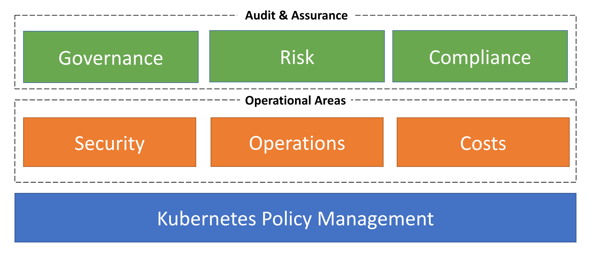
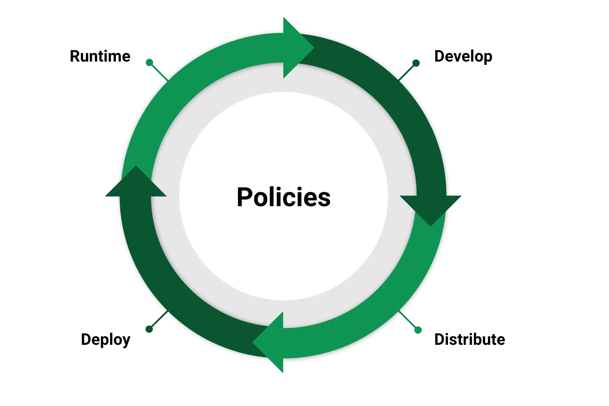
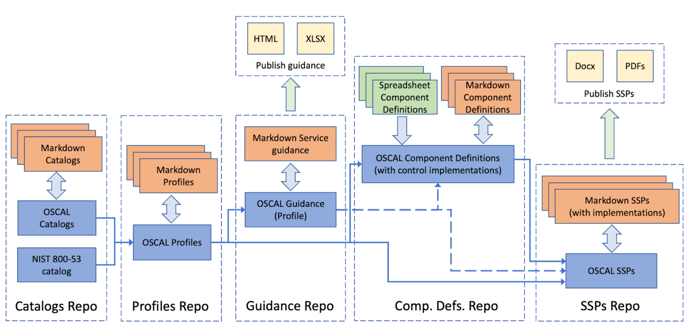

Policy-Based Kubernetes Governance, Risk, and Compliance
=========================================================

This paper provides guidance on how Kubernetes policies can be used to achieve organizational goals across governance, risk, and compliance.

# Introduction

Kubernetes has emerged as the “operating system for the cloud” (see [CNCF Annual Survey 2022](https://www.cncf.io/reports/cncf-annual-survey-2022/)) and is increasingly being used for critical production workloads.  

The [Kubernetes Policy Management](https://github.com/kubernetes/sig-security/blob/main/sig-security-docs/papers/policy/kubernetes-policy-management.md) paper provides a shared understanding of what policy management is and how it works for Kubernetes. This paper details why policies are essential for Kubernetes and why they matter to the business.

Kubernetes platforms that host critical workloads need to comply with internal and external regulatory compliance standards for security, availability, and other best practices. Ideally, these goals need to be implemented efficiently by Kubernetes platform engineering teams and application developers.

Kubernetes policies are a form of configuration management where policy-as-code resources are used to enforce other configuration and runtime behaviors.  Policy-based governance, risk, and compliance (GRC) for Kubernetes means adopting an approach where various personas and stakeholders are able to collaborate effectively and efficiently to achieve business or mission goals. 

A policy-based GRC approach, combined with Policy as Code (PaC) practices where policy resources are managed using software engineering best practices, enables several advantages:

* Industry best practices for security and other operational requirements are represented as policy artifacts which are versioned, authored, reviewed and approved by all required personas, managed as code, and deployed using GitOps based methodologies.

* Policy violations can be detected and automatically remediated where possible, and violations analyzed to fine tune policies or inform governance updates.

* Reduces operational cost for SREs/Admins, enables continuous security readiness and audit readiness for enabled controls, and fosters day-to-day collaboration resulting in consensus among key personas, each with distinct business goals.

In larger organizations, the stakeholders for Kubernetes platforms may span several teams such as operations, development, security, compliance, finance, and indirectly customers as well as investors of the platform. Each of these teams will have different views of the system, and hence, different requirements for governance. A policy-based GRC approach allows stakeholders to collaborate effectively.

The diagram below shows how Kubernetes GRC builds on policy management and spans several functions. The following sections discuss each of these in detail.

## Authors

* Anca Salier, IBM
* Andy Suderman, Fairwinds
* Gus Parvin, Red Hat
* Jayashree Ramanathan, Red Hat 
* Jim Bugwadia, Nirmata
* Poonam Lamba, Google
* Raj Krishnamurthy, ComplianceCow
* Robert Ficcaglia, Sunstone Secure

## Reviewers

The authors would like to thank all reviewers for their feedback and suggestions that helped shape this paper:

* Anders Eknert, Styra
* Tim Bannister, The Scale Factory
* Jimmy Ray, Boeing
* Michael Lieberman, Kusari
* Victor Lu, Fidelity
* Craig Box, ARMO
* Itay Shakury, Aqua Security
* Maor Kuriel, Opus Security
* Rory McCune, Datadog
* Chip Zoller, Nirmata
* Markus Gierlinger, Dynatrace
* Andrew Block, Red Hat

## Target Audience

This paper is intended for Kubernetes IT Operations Teams, Kubernetes Security and Compliance Teams, Technology Providers, Suppliers, and Vendors. These personas collaborate to enable Kubernetes clusters and workloads to be operated in compliance with organizational standards and regulatory compliance standards for security, resiliency, and best practices. Additional stakeholders include Chief Security Officers (CSOs), Chief Information Security Officers (CISOs), Chief Technology Officers (CTOs), Security and Compliance architects and managers, and Auditors. This paper also serves as a reference for anyone interested in Kubernetes security, governance, risk, and compliance.

## In Scope 

The [Cloud Native Security Whitepaper v2](https://github.com/cncf/tag-security/blob/7074a07ea79b894f611c553b5d6a52a77650ea27/security-whitepaper/v2/CNCF_cloud-native-security-whitepaper-May2022-v2.pdf) describes the Kubernetes security model through the lifecycle: Develop, Distribute, Deploy, and Runtime. This paper focuses on two specific layers - Containers and Clusters - within the Distribute, Deploy, and Runtime lifecycle stages. While the Develop lifecycle is not in scope for this paper, it also deserves consideration as part of an overall governance, risk, and compliance (GRC) strategy.

## Out of Scope
The following domain areas are not covered in this paper: 
* Cloud Provider: the infrastructure on which the container platform is running
* Application Code: Security aspects of application code and 3rd party dependencies
Also, these topics are out of scope
* Non-Kubernetes platforms
* Application Developers/development

# Governance

Governance is essential to align technology initiatives with business or organizational objectives. The following sections provide guidance on how policy-based governance can be applied to align Kubernetes initiatives with organizational goals and standards:

## Security

Security governance for Kubernetes includes defining and enforcing policies for security operational concerns across the Software Development Life Cycle (SDLC) phases. Depending on the size of the organization the approach to implement security governance for Kubernetes could be different e.g. a centralized team who is responsible for defining policies versus adopting a decentralized approach where there is a central team responsible for organizational wide policies and each team can have its own policies as well. Whichever model you choose, the way to achieve kubernetes governance is to define clear policies, start auditing or enforcing these policies and improve over time. Example policy libraries that can help you get started on policies for security governance are listed in the [Tools](#tools) section.

Implementing security governance as policy as code, can save time and help achieve defense in depth by using the same sets of policies evaluated across the multiple cloud native life cycle phases. 

### 1. Develop
Policies in the Develop phase enable shifting governance of security left, and allow getting early feedback via continuous integration.  Development environments can provide developers with immediate feedback on policy violations before changes can be committed. Examples of security aspects policies can be applied to include static code analysis, ensuring sensitive information is properly protected, andscoped network connectivity..

### 2. Distribute
The policies in the Distribute phase are contained in pipelines performing the same checks that were in the Develop phase.  Additional policies can be used to enforce image signing and to validate the integrity of images.

### 3. Deploy
At Deploy time, policies can work with Kubernetes admission controllers to limit resource creation to only permitted content. These policies can once again validate that policies in the previous phases have been followed and only content that has followed your organization’s deployment process can be deployed successfully.

### 4. Runtime
Security best practices do not end with the deployment of the applications.  Policies can be used to perform continuous auditing to not only validate what was deployed is still compliant, but to detect newly found vulnerabilities that are in your running images.  Runtime policies also must be in place for many other security best practices for Kubernetes clusters such as configuring logging, certificate management, container isolation, and protecting workload data from external threats.  It is important to reiterate that many of your policies for Runtime security governance are the same policies used in the previous phases.

More details on security best practices are also covered in:
* [Cloud Native Security Whitepaper v2](https://github.com/cncf/tag-security/blob/7074a07ea79b894f611c553b5d6a52a77650ea27/security-whitepaper/v2/CNCF_cloud-native-security-whitepaper-May2022-v2.pdf)
* [Cloud Native Security Controls Catalog v1.0 3](https://www.cncf.io/blog/2022/06/07/introduction-to-the-cloud-native-security-controls-catalog/)
* [Kubernetes Hardening Guide](https://media.defense.gov/2022/Aug/29/2003066362/-1/-1/0/CTR_KUBERNETES_HARDENING_GUIDANCE_1.2_20220829.PDF)
* [Kubernetes Security Checklist](https://kubernetes.io/docs/concepts/security/security-checklist/)
* [PCI Guidance on Container Orchestration](https://blog.pcisecuritystandards.org/new-information-supplement-guidance-for-containers-and-container-orchestration-tools).

Each of these can be mapped to policies that implmement necessary controls.

## Operations

In addition to security guardrails, policies are used to automate and report compliance for critical cluster and workload management tasks including:
* Best practices for the configuration of workloads, such as disallowing the use of the default or system namespaces, or requiring health checks for application containers. 
* Mutating resources for operational (e.g. logging, observability/telemetry, node placement, capacity, provisioning) defaults, required labels, and other configurations
* Automatically generating, updating, and deleting, fine-grained and dynamic resources based on flexible triggers, such as namespace or workload changes in environments where such policy-based dynamic configuration management practices are allowed. For example, policies can be used to automatically add image pull secrets and default network policies to each newly created namespace.
* Clean up unused resources for hygiene and cost reduction 

These cluster and workload lifecycle management concerns are typically in the purview of the Operations team tasked with cluster administration, and are critical to successful Kubernetes implementations.

A good example of operational governance is managing separation of concerns, and the isolation of applications and teams, in a shared cluster. Here, the operations team configures the cluster along with its required add-ons and governance policies. For example, the operations team can use tenant-scoped or cluster-scoped policies to automatically generate fine-grained roles and role-bindings, image pull secrets, network policies, quotas, and other resources when a new namespace is created for an application or team. When the workload is deployed, the configured operational policies are applied.  Additionally, cleanup policies can be used to audit items such as stale images and unused resources.

## Finance

Cloud computing has upended traditional models of cost forecasting, purchasing, and budgeting for infrastructure resources. Many different vendors, solutions, and practices have adapted to the idea of elastic on-demand compute, but Kubernetes introduces an additional abstraction layer on top of cloud providers (or even traditional infrastructure). This means that additional approaches need to be developed to address the concept of elastic compute in an environment where resources can be shared across multiple applications, teams, business units, etc.  There are multiple areas where financial governance in Kubernetes can be part of a complete financial operations strategy (or FinOps). 

Due to the fact that Kubernetes introduces an abstraction layer between running workloads and their cost (or compute), the first step in any plan involving cost in Kubernetes begins with reporting accurate information. Looking at the [Finops Framework](https://www.finops.org/framework/), we see that both the first domain and the first phase of the framework involve informing and reporting. Kubernetes provides mechanisms for adding metadata and segmenting workloads, which can both be utilized when trying to correctly understand the nature of cost distribution within a Kubernetes cluster or across an entire fleet of clusters. The primary way in which Governance plays a part here is in enforcing proper labels and best practices with regard to cost. The amount of compute (and cost) that a workload consumes will be determined by its resource requests and limits, and a workload can be attributed to a specific team or business unit by using labels, annotations, and/or namespace that the workload lives in. A financial governance strategy must contain some mechanism to enforce a coherent strategy across all clusters for both resource requests/limits and labeling or namespace segmentation.

The second primary area where a governance strategy and a FinOps strategy align is in enforcing configurations that adhere to a larger cost strategy. Cluster auto-scalers can be configured to use specific compute resources that follow a pre-purchased reserved instance pool, or be used to provision lower cost resources in a chosen cloud provider. Cluster operators should carefully consider if these configurations allow end-users to provision infrastructure that may incur runaway costs. Policies can be used to enforce labeling, node selectors, or provisioner configuration that adhere to a larger FinOps strategy. In addition to preventing the provisioning of expensive or out-of-strategy resources, a solid governance strategy will also keep in mind maximum efficient use of provisioned resources. Cluster auto-scalers also provide dynamic selection of resources for maximum resource usage efficiency. Allowing certain configurations, such as the requesting of specific instance types, tainting nodes for specific usage, and splitting workloads into too many instance groups, can result in poor utilization of resources. Governance strategies should take into account the optimal configuration of auto-scalers in order to promote efficiency.

# Risk 

Comprehensive risk management and governance of risk for Kubernetes requires developers, security teams, operations teams and data teams to develop:
* a threat model, 
* an assessment and measurement plan,
* a financial model for expected and “black swan” catastrophic risks, 
* a realistic contingency model and 
* a risk acceptance procedure and approval process. 

Platform Engineers, Compliance Engineers/Security Administrators and Auditors, must be able to identify and catalog specific risks in a Kubernetes cluster and define technical and operational controls to limit exposure to these risks. Policy-as-code artifacts can be used to put security and resiliency best practices in place to mitigate risks…”Mission owners must measure and predict the impact of the identified risks, and remediate those risks. This section attempts to clarify how to identify and respond to implicit and external Kubernetes risks.

Before cataloging risks, it is helpful to start with a definition of the data and components that need to be managed in the control plane, and then broaden the scope to include classification of the container workloads. Be sure to understand the various control plane configuration options and the impact of those configuration choices on the availability and integrity of the cluster.  Document in [Infrastructure as Code (IaC)](https://en.wikipedia.org/wiki/Infrastructure_as_code) comments or descriptions why specific configuration choices were made, and use Policy-as-code to ensure configurations were correctly made. Performing a criticality analysis of core workloads and the dependencies on the control plane, APIs, data sources and other workloads will help surface assumptions and make operational requirements more explicit, informing configuration choices. Chaos engineering and fault injection may be useful as well. A privacy impact assessment of how personally identifiable information is handled informs policy construction that aligns to applicable privacy requirements. Many jurisdictions now require determination of the privacy risks associated with a system, and controls to mitigate privacy risks.

Once the system has been cataloged and categorized, a risk assessment begins with a tailored threat model for the specific cluster and workloads.  CNCF published a [general Kubernetes threat model](https://github.com/trailofbits/audit-kubernetes/blob/master/reports/Kubernetes%20Threat%20Model.pdf) and other groups have added various [supplemental models](https://github.com/cncf/financial-user-group/tree/main/projects/k8s-threat-model/AttackTrees), but these are often too generic to be more than a reference.  System developers and Kubernetes DevOps SMEs should work together using an agreed upon threat methodology or framework, e.g., [STRIDE](https://learn.microsoft.com/en-us/azure/security/develop/threat-modeling-tool-threats#stride-model) ([(STRIDE threat model](https://github.com/accuknox/k8sthreatmodeling) example) or [MITRE ATT&CK](https://attack.mitre.org/), and then trace data flows across the Kubernetes control plane boundary, network segments, and namespaces to assess the potential threats and mitigations for each data flow and boundary. Operating in a multi-cluster and/or multi-tenant environment adds more complex use cases to the threat model. Part of that risk assessment should be a review of supply chain-related events that may allow unintentional or malicious introduction of code at any point during the system life cycle. 

Scanning for, and reviewing known vulnerabilities is an important ingredient in risk assessment. Risk scoring these vulnerabilities, and a useful rubric for Kubernetes specifically, is an area of [active discussion](https://docs.google.com/document/d/1osRamI9K2xgwHSHyUdx2IVl3k6tb3mYkVVPtGoKKt5c/).

Monitoring sources of attack and vulnerability intelligence from the [Kubernetes community](https://kubernetes.io/docs/reference/issues-security/official-cve-feed/), vendors, academic and public sources enriches the threat model.  Knowing how attackers are operating and awareness of specific threats in the community and the broader cyber ecosystem, in the form of specific case studies, and in aggregate reports or feeds, helps to identify and categorize risks and the impact of vulnerabilities to the various components. 

Some cloud providers, vendors and government entities use proprietary  AI/ML for predictive models to mitigate threats, vulnerabilities, and risks. AI is being used by vendors and cloud providers to train models on data to identify and disrupt incidents as early as possible in the attack sequence and to improve the speed and accuracy of responses. Collecting and analyzing indications of compromise in Kubernetes - such as network traffic outliers, unauthorized container deployments, unexpected cluster configuration changes, and the presence of malicious code in images - allows modeling and better training ML for prediction. More open source work needs to be done in this area.

Once risks are identified and categorized for impact, organizations need to proactively define a framework and specific criteria for responding to risk. Teams need to define how to mitigate a risk - within regulatory requirements - by implementing new controls or strengthening existing controls when accepting a risk where justification exists. There can be a business decision to avoid, transfer or share unnecessary risk, for example to defer or not implement a particular feature or use an already authorized component (eg. a FedRAMP Authorized Cloud). Kubernetes cluster operators and platform developers need to determine an appropriate decision framework for responding to a risk before deciding on a plan of action so that communication is timely and accurate. Managing risks means managing decision making.

A recommended approach to implementing policies for Risk Management in Kubernetes is to leverage a defined Threat Model (e.g. MITRE ATT&CK TTPs) and security capabilities that are scored for each functional component of the system. Security capabilities, deployed using policy-as-code as discussed in the security governance section,  are scored for their ability to mitigate each one of the threat actions using the [National Institute of Standards and Technology Cybersecurity Framework](https://www.nist.gov/cyberframework) functions: identify, protect, detect, respond, and recover. The scores are aggregated on a capability coverage matrix that measures how well each capability mitigates threat actions to each functional component. The capability coverage matrix is a “heat map” that can be used to perform gap, what-if, and layer/ location analyses. Using the observations surfaced through these analyses, organizations can improve their Kubernetes risk posture by making threat-based risk remediation investment decisions to mitigate current and future risks.

The risk tolerance of the organization influences risk response decisions and actions and can be encoded in policy-as-code and remediation playbooks and automation. Teams may use GitOps and create automated runbooks using a policy enforcement tool to apply configuration changes in scenarios where threats and vulnerabilities are detected. This reduces the timeline for remediation and prevents unintended damage due to ad hoc, untested responses and remediation steps, especially under schedule or SLA pressures.

The final capstone deliverable for a successful Kubernetes risk management effort is a tailored catalog of controls (e.g. a “profile” in [Open Security Control Assessment Language (OSCAL)](https://pages.nist.gov/OSCAL/), which is further described in the next Compliance section) that can map to specific risk management security capabilities and control implementations.  These control implementations and security capabilities can be measured and reports generated to produce evidence for both auditors and executive managers of risk.

# Compliance 

Compliance can be a business liability. Whether systems support a government, a healthcare, or financial services organization, each industry has its specific compliance standards that are required to be implemented and followed. Organizations are actively moving from the traditional sporadic regulatory audits to continuous compliance realms, where the system’s posture is available in near real-time dashboards. To effectively achieve continuous compliance, we need both automation and standardization. The key to achieving compliance automation is bridging the broad regulatory control statements expressed in human language to specific security, operational or financial policies such as those introduced above, together with their associated technology properties, configurations, and parameters. Compliance reporting and attestation serves as this “bridge” expressed as evidence for which the automation tests and validates the security, operational or financial policies.

Understanding the effective compliance requirements for an organization is often non-trivial. Regulations that apply to an organization may have different scopes, exception processes, penalties for non-compliance, or may have mutually exclusive expectations that require deconflicting. For instance, one regulation may require the retention of information for a specific duration (for example, six years), whereas another regulation may dictate erasure obligations of that same information. Managing the regulatory complexity and clearly stating the outcome for internal consumers of those requirements (such as internal audit, product leadership, platform engineers, or software developers) require governance that understands and aligns to that outcome so that policies are able to be authored that enforce the requirements, and potentially measure additional objectives or guidelines. This allows automated Policy Enforcement Points (PEPs) to effectively relay those complex decisions to internal teams with the appropriate context to their situation.

The [Kubernetes Policy Management White Paper](https://github.com/kubernetes/sig-security/blob/main/sig-security-docs/papers/policy/kubernetes-policy-management.md) introduced the XACML (eXtensible Access Control Markup Language) standard from OASIS (Organization for the Advancement of Structured Information Standards) as a good starting point for defining a policy management architecture for Kubernetes. 

Additionally, NIST provides [OSCAL (Open Security Control Assessment Language)](https://pages.nist.gov/OSCAL/) as a machine readable standard schema covering the entire compliance and risk management framework, complementing the policy realm, such as the XACML version for Kubernetes, with the compliance realm. Thus, OSCAL provides data models for programmatic representation of regulations or best practices catalogs (eg NIST 800-53 or Kubernetes CIS benchmarks) and their baselines or profiles (eg FedRAMP Low/Moderate/High or Kubernetes worker-node profile). OSCAL also provides the schemas for vendors to describe their products' implementation of regulatory controls via mapping to products’ security, operational or financial policies, as well as data models for their products compliance assessment results and plans of actions in case of non-compliance. Future roadmap in OSCAL includes additional support for crosswalk mappings and customer responsibility matrix as essential artifacts needed for posture and evidence reuse or inheritance across regulations and environments. 

The OSCAL compliance artifacts expressed as compliance as code in XML, JSON, and YAML, are like a Rosetta Stone i.e. a universal translator that enables tools and organizations to exchange compliance information. 

Key takeaways towards a successful compliance digitization program built on bridging the policy framework introduced in the Kubernetes Policy Management White Paper and OSCAL compliance framework, include: 

* **Collaborate on compliance authoring on a continuous basis:** Compliance personas - regulators, product vendors, CISOs, CTOs, and system owners - use compliance authoring tools to document the control statements, their guidance interpretation, profile and corresponding mappings to policies, or system security plans (SSP).  These tools also expose these documents as code. The compliance as code aims to support the end-to-end continuous compliance, automated versioning and traceability, and continuous change management. Besides automation, integrators of policy validation tools can reuse inheritable compliance as code artifacts such as profiles or component definitions to enable exports to weigh in on control validation accuracy, as well as to provide insight for integrators to prevent misconfiguration. (See [Tools](#tools) section for details on Compliance Authoring tools). 

* **Apply the same policy across all phases of the cloud-native lifecycle:** In the context of providing compliance assessment pre- as well as post-deployment, "write once and use multiple times'' means authoring one single declaration of the policy and re-using it at various points in the lifespan of an application: Develop, Distribute, Deploy, Runtime. In the CI/CD pre-deployment pipeline, we assess the policy posture for the deployment artifacts with the option to block a deployment if it is not compliant. While at runtime and at UI or CLI-based system change, we assess the policy posture for the systems and clusters already deployed. Reusing the same policy logic "written once" across the software lifecycle ensures the various posture results for a policy are semantically equivalent and no ambiguity shadowing the interpretation of a "pass" or "fail" meaning in the pre- or post-deployment context. 

* **Complement in-cluster checks with external checks:** In many cases external data, other than Kubernetes configurations, is required for efficient policy decisions. For example, an image verification check may require an up-to-date vulnerability scan report or a Software Bill of Materials (SBOM). Rather than performing these collection, analysis, and computation intensive tasks in each cluster, this external data can be generated or collected by other automation tools that run centrally and distribute data to OCI registries or other secure and efficient data stores that are accessible to in-cluster policy engines that act as policy decision and enforcement points. Also, ​​in addition to Kubernetes native policy tooling there are automation tools which can audit/validate policy based compliance and generate reporting. (See Tools section for details on Policy Automation Tools). 

* **Reuse the compliance artifacts across regulations:** Assessment results, evidence, and system security plans, are gathered using extensive and sometimes expensive resources. Avoiding rescanning or reassessing the regulated environment and processes by reusing the already collected artifacts is a must have capability to achieve scalability and timely  Authorization to Operate (ATO). Key to the solution for reuse is the OSCAL mapping artifact that allows the formal representation of the crosswalks between controls of a regulation for which we have collected the evidence and the associated assessment results and obtained the ATO, and a new regulation for which we pursue the ATO. Additionally, enriching rule evaluation with external data sources and policy rule templates, supports complex decision making that relates different regulatory requirements to specific organizational data without having to maintain separate, highly overlapping policy definitions. Ensuring your policies are reusable (i.e. Don’t Repeat Yourself (DRY)) helps with Day 2 policy governance. 

* **Standardize on a machine readable format:** Human readable formats such as xlsx, csv, or markdown make it difficult to be consumed by policy engines, compliance hubs, GRC tools, via programmatic interfaces. Open source tools implementing OSCAL (See Tools section for Compliance Authoring recommendations and details) enable the creation of machine readable compliance artifacts. Thus, crossing from the GitOps based compliance authoring into runtime policy evaluation with its assessment plans, assessment results from the policy engines, the compliance hubs benefit from a common denominator data model and format across those artifacts. A common format and data model is required to meaningfully interlock, aggregate, and report across various tools and environments. Ensuring the CAP, PAP, PEP/PVP and Policy Information Point (PIP)s interfaces are aligned to a standard will save a lot of time and labor towards achieving continuous compliance and meaningful aggregations and reports for regulated environments.

Through the bridging of OSCAL Compliance as Code and control validation/enforcement in Policy as Code, we can begin to establish a source of truth for assessing system workloads before deployment and during runtime. These OSCAL artifacts can leverage the declarative nature of Kubernetes resource configuration to map when a control is implemented and how to validate. This will enable tool authors to write automation that supports:
* Identification of a OSCAL artifact
* Static analysis of manifests
* Runtime analysis of live resources
* Identification of misconfigurations
* Integration with policy engines to provide enforcement of compliance
* Generation of reports in the Assessment Results Model
* Expose or upload reports to GRC Tooling

# Tools

> **Note:** This section links to third party projects that provide functionality for Kubernetes. The Kubernetes project authors and CNCF aren't responsible for these projects, which are listed alphabetically. To add a project to this list, read the [content guide](https://kubernetes.io/docs/contribute/style/content-guide/#third-party-content) and [CNCF Website Guidelines](https://github.com/cncf/foundation/blob/main/website-guidelines.md) before submitting a change.

A community catalog of best practice policies can provide a starting point to implement policy-based GRC for the various domains discussed above. Several communities have formed to provide such policies for best practices in Kubernetes GRC, and enable the open sharing of contributions and improvements.

## Policy Engines
* [jsPolicy](https://www.jspolicy.com/): jsPolicy allows easier & faster Kubernetes Policies using JavaScript or TypeScript.
* [Kyverno](https://kyverno.io/): Kyverno is a policy engine designed for Kubernetes that allows validation, mutation, generation of resources and image verification, with no complex language necessary.
* [KubeWarden](https://www.kubewarden.io/): Kubewarden is a policy engine for Kubernetes. It helps with keeping your Kubernetes clusters secure and compliant.
* [OPA/Gatekeeper](https://open-policy-agent.github.io/gatekeeper/website/) provides admission control capability that can act on policies to check for conformance to best practices.
* [Polaris](https://www.fairwinds.com/polaris): Polaris is an open source policy engine for Kubernetes that validates and remediates resource configuration. It includes 30+ built in configuration policies, as well as the ability to build custom policies with JSON Schema.

## Runtime
* [Falco](https://falco.org/) : A cloud native runtime security tool that primarily monitors kernel events for unwanted activity on nodes
* [KubeArmor](https://kubearmor.io/): KubeArmor uses eBPF and Linux Security Modules (LSM) to provide policy based system to restrict any unwanted, malicious behavior of cloud-native workloads at runtime.
* [Tetragon]() : Cilium’s new Tetragon component enables powerful real time, eBPF-based Security Observability and Runtime Enforcement.
* [Tracee]() : Tracee uses eBPF technology to tap into your system and give you access to hundreds of events that help you understand how your system behaves.

## Vulnerability Scanners
* [Grype](https://github.com/anchore/grype) : A container image, file system, and SBOM vulnerability scanner.
* [Trivy](https://github.com/aquasecurity/trivy) : A vulnerability scanner for container images, git repositories, file systems, kubernetes clusters, and more. Trivy can also be used to scan configuration and generate SBOMs.

## Configuration Scanners
* [Cloud Custodian](https://cloudcustodian.io/) : A rules engine that can detect, alert on, and/or modify resources that are misconfigured in public cloud accounts.
* [kube-bench](https://github.com/aquasecurity/kube-bench) : kube-bench is a tool that checks whether Kubernetes is deployed securely by running the checks documented in the CIS Kubernetes Benchmark.
* [Kubescape](https://github.com/kubescape/kubescape) : Kubescape is an open-source Kubernetes security platform. It includes risk analysis, security compliance, and misconfiguration scanning

## SBOM Generators
* [OSS Review Toolkit](https://github.com/oss-review-toolkit/ort) - A suite of tools for managing open source projects including SBOM generation, dependency management, and technically enforcing the policies of a project.
* [sbom-tool](https://github.com/microsoft/sbom-tool) - Tool to create SPDX 2.2 compatible SBOMs for any variety of artifacts.
* [Syft](https://github.com/anchore/syft) - generates SBOMs from container images and filesystems.
* [Tern](https://github.com/tern-tools/tern) - A software composition analysis (SCA) tool that creates SBOMs for containers.

## Compliance Authoring
* [Trestle](https://ibm.github.io/compliance-trestle/) is an ensemble of tools that enable the creation, validation, and governance of documentation artifacts for compliance needs. It leverages NIST's OSCAL as a standard data format.

## Multi-cluster Governance
* [Open Cluster Management](https://open-cluster-management.io/) : Provides a multi-cluster management technology that can be used  to manage multiple clusters for creating/importing clusters, configure them to desired state using policies
* [ArgoCD](https://argo-cd.readthedocs.io/): Argo CD is a declarative, GitOps continuous delivery tool for Kubernetes. It can be used to deploy and manage Kuberentes resources, including policies, across clusters.
* [Flux](https://fluxcd.io/): Flux is a set of continuous and progressive delivery solutions for Kubernetes that are open and extensible. It can be used deploy and manage Kuberentes resources, including policies, across clusters.

## Policy Automation Tools
* [Auditree](https://auditree.github.io/) allows you to automate the evidence collection and policy verification, and build up a long term store of evidence in an “evidence locker”. The collection of evidence is done by “fetchers”, the verification by “checks”. 
* [Ansible](https://www.ansible.com/) is a generic IT automation system. In this white paper GRC context, its usage is intended to support automating the evidence collection and policy verification. It can handle configuration management, application deployment, cluster provisioning, ad-hoc task execution, network automation, and multi-node orchestration related policies. 
* [Lula](https://github.com/defenseunicorns/lula) is a tool written to bridge the gap between expected configuration required for compliance and actual configuration.

# Conclusion 

In this paper, we outlined how Kubernetes policies can be used as a foundation for realizing business goals of governance, risk, and compliance (GRC). We outlined considerations to do so for various aspects, such as security, operational, financial, compliance, and risk management.

With such an approach, governance is policy-based, resulting in ease of conformance to internal and external standards and best practices. Compliance can be layered on top of policy management, thereby providing a bridge between these two domains, and effective collaboration among personas in each of these domains, resulting in a foundation for continuous compliance.

An automated governance and compliance approach in turn leads to timely identification of business risks, and prioritized operational actions to remediate such risks. In this manner, for controls for which such governance, risk, and compliance principles are in place, a business can achieve continuous security and audit readiness. 
