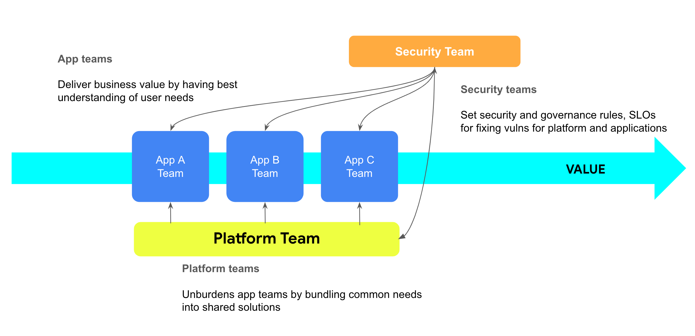
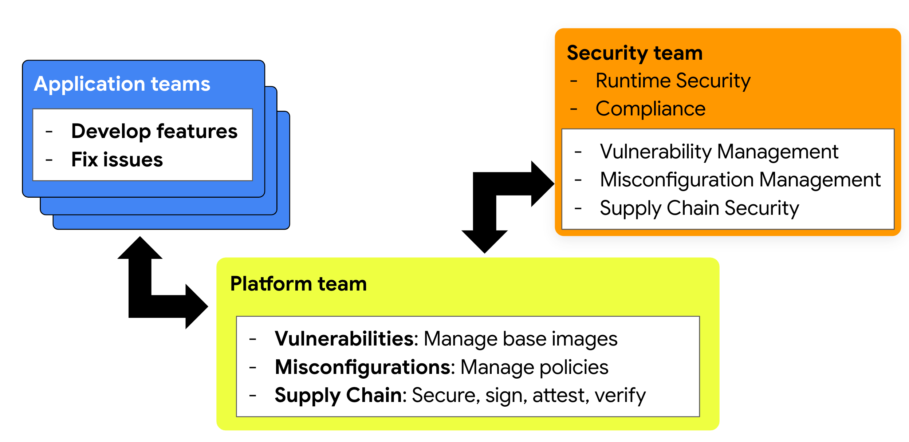

<H1>Shift-Down Security</H1>

<h2>How Cloud Native Platform Teams Can Help Break the Logjam<h2>

# Authors

* Poonam Lamba, Google  
* Jim Bugwadia, Nirmata  
* Glen Yu, PwC 
* Anca Sailer, IBM

# Reviewers

* Alan Diaz, JPMorganChase  
* Myles Hosford, Independent
* Simon Bäumer, Red Hat
* Brandt Keller, Defense Unicorns
* Sachin Agarwal, Nirmata  

# Contents

## Introduction

Kubernetes has emerged as the de facto standard for container orchestration, enabling organizations to build scalable, resilient, and portable applications. However, the dynamic and distributed nature of Kubernetes environments presents unique security challenges. Traditional security practices, designed for static infrastructure, are often insufficient to protect these complex environments. 

Additionally, Kubernetes is increasingly being used as a platform for building internal developer platforms within organizations. This offers a unique opportunity to standardize security best practices across application teams, within an organization.

Security is a shared responsibility. While shift-left security emphasizes developer responsibility for security, shift-down security focuses on building security directly into the platform.  By creating an environment that is secure by default with built-in policies, developers can be empowered with self-service while maintaining a secure and compliant platform.

This paper explores the security challenges posed by Kubernetes, the limitations of traditional security approaches, and proposes a shift-down security model to address these challenges effectively.

# Audience

This paper is intended for platform engineers, and security professionals, who are working with Kubernetes and cloud native technologies. Additional stakeholders include Chief Security Officers (CSOs), Chief Information Security Officers (CISOs), Chief Technology Officers (CTOs), Engineering Managers, Cloud architects, and Security architects.

## Security Impacts of Cloud Native Technologies

Cloud-native technologies offer enhanced scalability, faster deployment, increased agility, and lower costs. However, they also introduce new complexities and challenges.

**Containers:** while efficient and agile, containers offer a very different isolation and security model than traditional Virtual Machines.

**Misconfigurations:** Kubernetes and cloud native systems are highly declarative and designed for automation. This creates complex configurations, that when not properly managed can lead to data exfiltration at a cloud provider level and privilege escalations at the Kubernetes level.

**Cloud IAM and Kubernetes RBAC:** Managing permissions across multiple dynamic layers and systems adds complexity and requires coordination across distinct identity and access models.

**Larger Dynamic Attack Surface:** Multiple workloads running in the same platform also leads to multiple entry points. Combined with IaC and self-service automation, these environments require different approaches to security.

## Shift-Left Security

Shift-left security, which prioritizes integrating security practices early in the software development lifecycle (SDLC), offers significant benefits but faces challenges in cloud-native environments. Developers, often lacking specialized security expertise, may struggle to effectively mitigate the complex security risks inherent in these dynamic environments. Furthermore, the fluid nature of cloud-native infrastructure means vulnerabilities can emerge during deployment and runtime, even with a shift-left approach.

## Introducing Shift-Down Security

Shifting down security recognizes that security is not solely the responsibility of developers but a shared responsibility between application, platform, and security teams. It emphasizes continuous monitoring, automated security controls, self-service and adaptive security measures to address the dynamic nature of cloud-native environments.

This approach complements shift-left security by standardizing and enforcing security across all applications and throughout their entire lifecycle, from development to deployment and runtime. It extends security practices beyond development and into the operational aspects of Kubernetes, promoting close collaboration between teams for a more robust and resilient security posture.

There are three key elements that define a successful Shift-Down Security strategy:

1. **Cross-cutting security concerns are addressed by the platform**: Rather than each application team directly dealing with security concerns, the platform engineering team identifies and addresses common concerns. 

2. **Security is codified, automated, and collaborative**: Cloud-native technologies and best practices like Policy as Code allow security to be automated and proactively enforced across the application lifecycle. Security artifacts, such as policy declarations, must be managed “as code” using software engineering best practices such as version control and two-person code reviews. The tooling for managing security related artifacts needs to be open and accessible to all stakeholders, for a collaborative approach.

3. **Platform security complements shift-left and existing processes**: Moving common security elements for an organization into the platform is meant to elevate and optimize security processes and improve results. It does not replace the need for all stakeholders to participate and contribute.

## Implementing Shift-Down Security

There are three examples of how platform engineering teams can help build security into cloud native platforms, to ease the burden on central security and development teams. We are not focusing on the methodology to build the platform itself. The concepts here apply once you have built the platform and are looking to run applications on the platform. 

These are also cross-cutting areas across the organization: 

1. Reducing vulnerabilities   
2. Reducing misconfigurations   
3. Improving software supply chain security

### Shift-Down on managing vulnerabilities

**Cross-cutting security concerns are addressed by the platform:** To enhance security and streamline vulnerability management, we recommend adopting a strategy where platform teams take ownership of addressing vulnerabilities in images(both OS and container base images), and adopt a strategy to deliver minimal and hardened images to application teams. 

By maintaining and regularly updating "golden images," you can ensure a secure foundation for all deployments. Keeping base images small minimizes the potential attack surface, further reducing risks. "Small" in this context means more than just size; it implies removing unnecessary packages and dependencies that could introduce vulnerabilities. This lean approach to image construction limits the potential for exploitation and strengthens your overall security posture.

**Security is codified, automated, and collaborative:** Container technologies also allow [direct patching of images](https://github.com/project-copacetic), which can further aid in automation of managing base images. 

The difference in the number of vulnerabilities in official public images, and minimal hardened images can be huge, resulting in hundreds of fewer vulnerabilities that application and security teams need to deal with, saving significant time and money. Best practices in managing base images include continuous patching and updates, and adopting emerging standards like [Vulnerability Exploitability eXchange (VEX](https://www.cisa.gov/resources-tools/resources/minimum-requirements-vulnerability-exploitability-exchange-vex)).  

**Platform security complements shift-left and existing processes:** Managing minimal and CVE free base images allows development teams to focus on their core tasks, while relying on the platform teams to provide secure and optimized base images. Furthermore, the scanning can be done during the CI/CD pipeline which can save time if there is a vulnerability that needs to be addressed. 

### Shift-Down on managing misconfigurations

Misconfigurations in Kubernetes and cloud native systems represent a huge security challenge, often serving as an open door for attackers to exploit vulnerabilities and gain unauthorized access.  These misconfigurations often arise from the inherent complexity of the Kubernetes ecosystem, with its dynamic nature, and numerous interconnected components and settings that address a broad and diverse range of use cases.  
Unintentional oversights and errors, such as lack of pod security, lack of, or overly permissive, network policies or granting excessive privileges, can inadvertently create weaknesses in the system's defenses. Moreover, the default configurations of some Kubernetes components may prioritize ease of use over robust security, leaving clusters exposed unless proactively hardened.

**Cross-cutting security concerns are addressed by the platform:** We recommend that platform teams implement the guardrails such as [Pod Security Standards (PSS)](https://kubernetes.io/docs/concepts/security/pod-security-standards/), RBAC and common networking policies across the organization.

Policies that enforce PSS prevent container breakouts and directly address basic misconfigurations in Kubernetes. 

* Platform policy examples from PSS include preventing host network and PID namespaces, enforcing read-only root filesystems, restricting capabilities etc.  
* Application policy examples include preventing privilege escalation, running as root etc.

However, pods are just the basic unit of deployment; a typical Kubernetes workload may include hundreds of other resource objects and configurations which need to be compliant and secure. 

Policies are also required to enforce compliance for RBAC settings for least-privileged access, workload security and best practices, multi-tenancy, network segmentation and isolation. Kubernetes is designed to be extensible, and policies must be used to enforce security and best practices compliance for each extension e.g. Service Meshes. 

**Security is codified, automated, and collaborative:** We recommend using a cloud native Policy as Code (PaC) solution, that provides flexible management of configurations, with proper reporting and visibility across DevSecOps roles. By doing this, multiple teams can collaborate by using Git or similar tools to define and review policies at multiple levels within an organization. 

Implementation of centralized policies empowers platform and security teams to define and enforce security, best practices, and operational automation policies across clusters and workloads, eliminating the need for individual application teams to try and secure each individual application. 

Kubernetes provides admission controls, where each and every change request can be inspected for compliance against configured policies. An admission controller can block misconfigurations to proactively enforce security and best practices. Mutation webhooks from Kubernetes can also be leveraged for setting known defaults by platform teams. Policy as Code tools such as [Gatekeeper](https://open-policy-agent.github.io/gatekeeper/website/docs/) or [Kyverno](https://kyverno.io/) are good examples of policy engines designed for Kubernetes which can help you with the admission controls, as well as resource audits, mutations, Just In Time (JIT) generations and much more.

**Platform security complements shift-left and existing processes:** As a best practice, the same policies should also be enforced in continuous delivery pipelines. Combined with Pull-Request driven workflows, policies can be applied to Kubernetes manifests, as well as IaC (Infrastructure as code) manifests and container build files.

This approach prevents costly misconfigurations, streamlines policy management, reduces overhead for application, platform and security teams, and ensures consistent security and compliance enforcement across the organization.

### Shift-Down on software supply chain security

In recent years, savvy attackers are increasingly exploiting build and continuous delivery systems to penetrate hundreds of production systems. 

**Cross-cutting security concerns are addressed by the platform:** As with Kubernetes clusters and cloud native environments, platform engineering teams can help ensure best practices, security and compliance for build systems and delivery pipelines.

The [Supply-chain Levels for Software Artifacts (SLSA)](https://slsa.dev/) specification is an Open Source Security Foundation (OpenSSF) project that helps improve supply chain security. It provides incremental levels of security best practices making it easy to adopt and enforce. 

**Security is codified, automated, and collaborative:** A best practice is to sign container images, and verify provenance and integrity of these images prior to deployment, using Policy as Code solutions that integrate with admission controls. Along with image signatures, a policy-based solution can also verify the build environment and other best practices.

**Platform security complements shift-left and existing processes:** We recommend that Platform Engineering teams implement image signing and verification and standardize best practices for build systems and delivery pipelines.

## Shared Responsibility Matrix 

The Shift-Down Security approach helps streamline work across application, platform, and security teams. However, each team still needs to do their part\! Each team’s part is sourced in the list of control requirements assigned to the DevSecOps in the three main areas described above, vulnerability, infrastructure configuration, and software supply chain security management. 

While each organization will be different, there are common emerging patterns and best practices for DevSecOps teams, that are described below for managing vulnerabilities and misconfigurations. We recommend each organization document and maintain such a shared responsibility model, so the expectations and workflows are clear.

## Vulnerability Management

### Platform Team responsibilities

* Maintain minimal and hardened container base images to reduce CVEs  
* Automate processes for managing images across applications  
* Automate processes for enforcing CVE scanning and reporting in build pipelines

### Application Team responsibilities

* Regularly updates base images and application dependencies  
* Monitor application repositories for CVEs 

### Security Team responsibilities

* Establish organizational standards and SLAs for CVEs   
* Monitor production environments for compliance  
* Approve exceptions when required

## Misconfigurations

### Platform Team Responsibilities

* Define and maintain Policy as Code for security, compliance, costs, and operational best practices  
* Manage deployment of policy artifacts across relevant clusters  
* Manage policy enforcement points for CI/CD pipelines, clusters, and other runtime environments 

### Application Team Responsibilities

* Address policy violations reported for application manifests and artifacts 

### Security Team Responsibilities

* Define the required organizational governance and compliance standards  
* Define SLAs requirements for organization for addressing policy exceptions  
* Manage policy exceptions across teams

## The Benefits of Shift-Down Security

Here are some of the key benefits of adopting a Shift-Down Security strategy:

**Proactive Enforcement:**  Shifting common security concerns into the platform helps scale security for developers and with Shift-Left implementation we can scale security, proactively identify risks, and address them before they can be exploited. This creates a more secure foundation for applications and empowers developers. 

**Reduced Noise**: Central security teams can now focus on what matters, instead of thousands of alerts that they may not be in the position to address.

**Increased Agility**: With fewer vulnerabilities and early prevention of misconfigurations, developers can focus on delivering business value instead of being bogged down with mundane tasks.

**Adaptive Security:** Automated security controls can adapt to the dynamic nature of Kubernetes environments, ensuring security policies are consistently enforced. Policy based solutions can generate Just-In-Time (JIT) configurations for secure defaults implementing a least privileged approach.

**Improved Collaboration:** A shared responsibility model fosters collaboration between teams, leading to more effective security outcomes.

**Enhanced Visibility:** Continuous monitoring provides visibility into the security posture of Kubernetes environments, enabling quick detection and response to threats.  

## The Time for Shift-Down Security is Now

With the modernization of microservices development and the increasing shift towards a cloud-native approach, there has been a significant impact on the landscape of security and governance. 

The emergence of Platform Engineering emphasizes the growing need of enabling developer agility with self-service. However, for a platform strategy to succeed security needs to be embedded into the platform itself.

The advent of cloud-agnostic infrastructure, designed to support these services, has introduced considerable complexity and dynamism into workflows and operations. Consequently, there is a need for a comprehensive solution that can effectively address these dynamic environments and provide a robust foundation for overall security and governance.

## Conclusion

Kubernetes and cloud native technologies offer significant benefits for organizations. However, they can also introduce new security challenges and require new approaches for security. 

By “shifting down” security into the operational aspects of cloud native platforms, organizations can better protect their applications and data, and increase agility for developers. 

The Shift-Down Security approach requires a combination of security automation using Policy as Code (PaC), collaboration across developers, operations, and security, and continuous tuning to ensure the security and resilience of Kubernetes environments.

## References

* [Shift Down Security\! How Platform Teams Can Help Break the Logjam - Jim Bugwadia & Poonam Lamba](https://www.youtube.com/watch?v=mbqUhzhXt4s)   
* [Richard Seroter on shifting down vs. shifting left | Google Cloud Blog](https://cloud.google.com/blog/products/application-development/richard-seroter-on-shifting-down-vs-shifting-left)   
